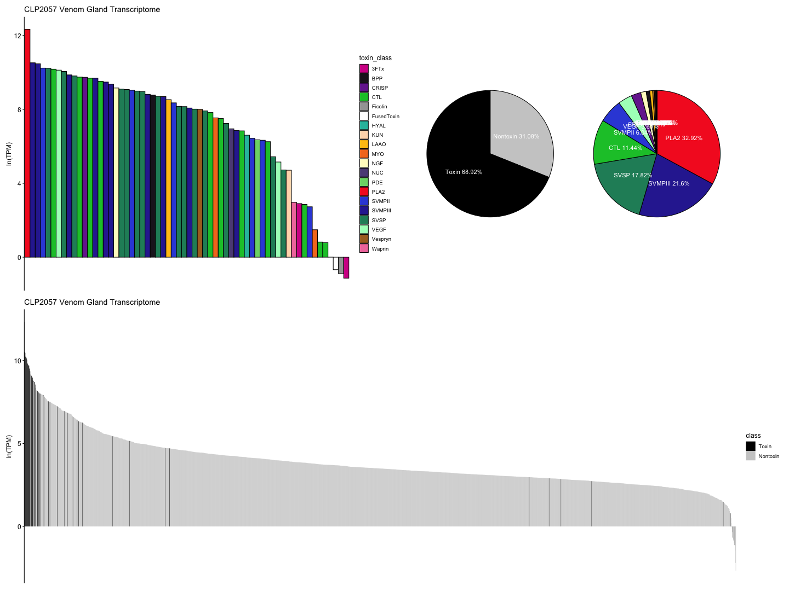
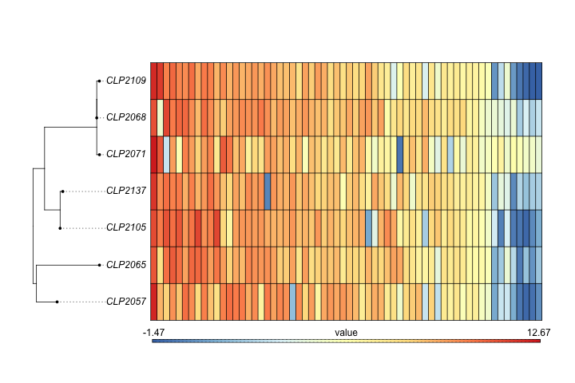
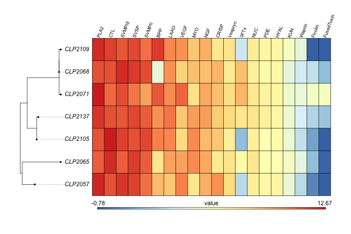
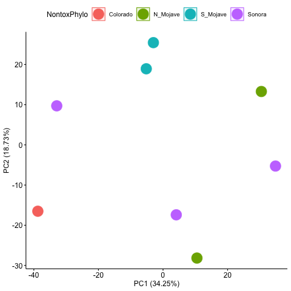

# The Guide to Venom Gland Transcriptomics
### Pedro G. Nachtigall, Rhett M. Rautsaw, Schyler Ellsworth, Andrew J. Mason, Darin R. Rokyta, Christopher L. Parkinson, Inácio L.M. Junqueira-de-Azevedo

# Table of Contents
-   [Introduction](#introduction)
-   [Basic Bioinformatics](#basic-bioinformatics)
    -   [Training Resources](#training-resources)
    -   [Lists](#lists)
    -   [Piping & Regular Expressions](#piping-regular-expressions)
    -   [Renaming Files](#renaming-files)
    -   [Bash Profile](#bash-profile)
-   [Setup/Installation](#setupinstallation)
-   [The Guide](#the-guide)
    -   [Downloading Data](#downloading-data)
    -   [Pre-Processing](#pre-processing)
    -   [Transcriptome Assembly](#transcriptome-assembly)
    -   [Transcriptome Annotation](#transcriptome-annotation)
    -   [Removing Chimeras](#Chimeras)
    -   [Clustering](#clustering)
    -   [Annotation Check (*Optional*)](#annotation-check-optional)
    -   [Estimating Expression](#estimating-expression)
    -   [Expression Visualization](#expression-visualization)
    -   [Differential Expression](#differential-expression)

Introduction
============

The Guide to Venom Gland Transcriptomics is part of
[Venomancer](https://github.com/pedronachtigall/Venomancer) and designed
to walk you through our recommended bioinformatic pipeline. If you are
new to bioinformatics, don’t panic! There are some resources and
information provided at the beginning of the document to get you through
the basics. Overall, The topics covered in this guideline include:

-   Basic bioinformatics
-   Raw data processing
-   Transcriptome assembly
-   Transcriptome annotation
-   Checking for chimeric transcripts
-   Clustering redundant transcripts
-   Checking for rogue/missing transcripts
-   Proteomic annotation
-   Estimating expression
-   Post-processing visualization
-   Differential expression analysis

Basic Bioinformatics
====================

This first section is largely for people who don’t have much experience
with `unix`, `python`, `R`, or bioinformatics in general. While this
guide is not designed to teach you all of these things, we do recommend
you check out the resources below. If you do have experience in `unix`,
depending on your level of experience, there might still be something
new we can teach you.

### Training Resources

Clemson University provides several freely-available workshops to get
you started learning `unix`, `python`, `R`, and more:

-   [Clemson Computing and Information Technology
    Resources](https://citi.sites.clemson.edu/resources/)
    -   [Linux Workshop](http://clemsonciti.github.io/linux-workshop/)
    -   [Python
        Workshop](https://clemsonciti.github.io/python-workshop/)
    -   [R
        Workshop](https://clemsonciti.github.io/workshop-r-intro-data-science/)
    -   [Genomics
        Workshop](https://clemsonciti.github.io/genomics-workshop/)

In addition, some other useful resources might be:

-   [SWIRL: Learn R in R](https://swirlstats.com/)
-   [Learn-Bioinformatics
    Resources](https://github.com/czbiohub/learn-bioinformatics)

**STOP**

Again. Don’t panic. But from here on, we assume that you have basic
knowledge of `unix`. If you do not, please return to the workshops
above. Otherwise continue on…

### Lists

Lists are your *best friend* in coding. A list – very simply – is a text
file containing all the names of your samples or identifiers that you
will want to loop through or process in parallel. You can create a text
file with the command `nano {file}.txt` and save the file using keyboard
shortcut `ctrl+o` and exit with `ctrl+x`. A list will look something
like this:

``` bash
sample_1
sample_2
...
sample_n
```

You can also create lists by simply saving the output of `ls` to a file.
For example:

``` bash
ls *.fastq > list.txt
```

Once you create a list, you can provide it to a `for loop` or to the
`parallel` command to process many samples the same way – and even
simultaneously – without actually having to redo the same command over
and over again. For example:

``` bash
for i in `cat list.txt`
do echo ${i}
done

# OR

parallel -a list.txt "echo {}"
```

We will be providing lists to the command `parallel` in nearly every
step of the Guide.

### Piping & Regular Expressions

Piping – initiated with a `|` – is simply taking the standard OUTPUT of
one command and feeding it into the standard INPUT of another. This can
be useful for doing several commands in a row. Below, you will see that
I use piping to create 3 different lists based on the fastq files I have
in a directory.

The first list I create is a list of the unique individuals which we
will use throughout the pipeline. In this list, each individual has it’s
own line. The second two lists remove new line characters and replace
them with spaces so that all individuals are on a single line.

``` bash
ls *.fastq.gz | cat | perl -pi -e 's/_.*.fastq.gz//g' | uniq > list.txt
sed "s/$/_R1.fastq/g" list.txt | tr '\n' ' ' | sed '/^\s*$/d' > list2.txt
sed "s/$/_R2.fastq/g" list.txt | tr '\n' ' ' | sed '/^\s*$/d' > list3.txt
```

Based on those lines of code, hopefully you understand that I am taking
the output of the first command and feeding it into subsequent commands.
However, you may be asking…what are `perl -pi -e`, `sed`, and `tr`?

Hopefully at some point, you have learned about `grep` and it’s ability
to search and print for specific text in a document. What you may not
know is that `grep` stands for Global Regular Expression Print. `grep`,
`perl -pi -e`, `sed`, `tr`, and `awk` all use something called **Regular
Expressions** or **regex** to find and/or replace text. I’ve used 3
different find/replace methods to generate my lists, but they are all
essentially doing the same thing. **regex** can take some getting used
to, but they are used VERY frequently and are incredibly useful in
`unix` scripting. So take some time to learn them!

Useful **regex** resources:

-   <a href="https://www.rexegg.com/regex-quickstart.html" class="uri">https://www.rexegg.com/regex-quickstart.html</a>
-   <a href="https://regexr.com/" class="uri">https://regexr.com/</a>
-   <a href="https://awk.js.org/" class="uri">https://awk.js.org/</a>
-   <a href="https://sed.js.org/" class="uri">https://sed.js.org/</a>

Each of the different methods have own features and intricacies;
therefore, you may have to change between them. However, you will pick
your favorite (whichever you learn first) and use it most frequently. My
personal preference and the option I am most familiar with is
[`perl -pi -e`](https://stackoverflow.com/questions/6302025/perl-flags-pe-pi-p-w-d-i-t).

### Renaming Files

Sometimes files might have something you don’t want or you need to
rename them in some way. If it is only one file, a simple `mv` command
will do the trick. However, when there are a lot of files, renaming all
of them can be a pain. Below, I provide three options for removing an
unwanted underscore in all my file names.

**Option 1**: The `mv` strategy

``` bash
for i in sample_*.fastq.gz
  do mv "${i}" "${i/sample_/sample}"
  done
```

**Option 2**: The `find` and `rename` strategy

``` bash
find . -name "sample_*" -exec rename "sample_" "sample" {}\;
```

**Option 3**: The `bash` script strategy

This strategy take a little more manual work, but is useful when you
have less regular patterns to change, where each individual gets a
slightly different name (*e.g* adding the species code which is found in
a spreadsheet somewhere). In this situation, let Microsoft Excel help
you.

To do this, create a list of all your individuals that need renamed. You
can then copy-paste your list into Microsoft Excel to use things like
find-replace and `VLOOKUP` to add a column including the species code.
You can also create a column to copy repeat elements like `mv`
efficiently across all your individuals. Concatenate all your columns
together and move it into a text document like the example below. Once
you create your text bash script, you can just run `sh script.sh` to do
all the work for you.

``` bash
#!/bin/bash

mv sample_001.fastq.gz sample-001.fastq.gz
mv sample-2.fastq.gz sample-002.fastq.gz
mv sample_3.fastq.gz sample-003.fastq.gz
#mv [MORE INDIVIDUALS]
```

### Bash Profile

Each step of the Guide assumes that you have already
installed all the programs that you need and it can be easily run by
just typing in the appropriate command (*i.e.*, `trinity`). Lets talk
about how to make that assumption true.

First, in your home directory (`cd ~`) you will have a hidden file
called your `.bash_profile`. Remember, to see hidden files you have to
use the `ls -a` command. If you do not have a `.bash_profile` in your
home directory, go ahead and create one with `nano .bash_profile`.

If you don’t already know this, your `.bash_profile` is what is loaded
every time you open a terminal/shell. It contains your specific
configuration settings including your `$PATH`, which is a variable set
to all possible directories where your installed programs exist. My
`.bash_profile` looks like this and may be a good starting point for
you:

``` bash
# Bash Profile

# User Profile
PS1="[Rhett@Macbook: \W] $ "

# SSH Profiles
alias remote="caffeinate ssh username@login.remote.server.edu"

# Alias Functions
alias ll="ls -lh"
alias d="conda deactivate"
alias bio="conda activate bio"
alias envs="conda info --envs"

# PATH
export PATH=/usr/local/bin:/usr/bin:/usr/sbin:/bin:/sbin
export PATH="$PATH:~/path/to/bin:~/path/to/bin/scripts"
```

From my `.bash_profile`, my computer knows that when I start a
terminal/shell it should print out `[Rhett@Macbook: ~] $` at the
beginning of each line, that each `alias` is a shortcut that does a
specific command, and that it needs to export `$PATH` as:
`~/path/to/bin:~/path/to/bin/scripts:/usr/local/bin:/usr/bin:`
`/usr/sbin:/bin:/sbin`. This string represents the location of several
folders on my computer where scripts, commands, and programs that I have
manually installed may be found.

As you may have noticed, we still haven’t installed any programs. We’ve
only told the computer where to find programs. There’s a long chunk of
code that I didn’t show you in my `.bash_profile`. What is says is
unimportant, but it has to do with
[Anaconda](https://www.anaconda.com/distribution/#download-section).
`Anaconda` is a package/software management toolkit which creates
self-contained environments and installs programs within them. It also
edits your `.bash_profile` for you! Therefore, I do most program
installation through `Anaconda`, which we will talk about in the next
section…

Setup/Installation
==================

[Anaconda](https://www.anaconda.com/distribution/#download-section) is a
package/software management toolkit. I highly recommend you install
`Anaconda` to make your life easier and avoid having to install many
programs by hand.

When you install `Anaconda`, it will automatically add something to your
`.bash_profile` which will enable the computer to find programs
installed by `Anaconda`. The reason `Anaconda` is so great is that
software often do not play nicely for one another. For example, while
one program may want to use `python v2.7` another may want to use
`python v3.5`. `Anaconda` allows you to create self-contained
environments within which everything works nicely! If something needs a
different version of a program…simply create a new environment! Here’s a
[**cheatsheet**](https://docs.conda.io/projects/conda/en/4.6.0/_downloads/52a95608c49671267e40c689e0bc00ca/conda-cheatsheet.pdf)
for using `Anaconda`.

After you install `Anaconda`, we can create some environments for later
use. Here’s how you do that:

``` bash
# You do not need to do this every time, but this sets up what "channels" anaconda should look into for programs you are trying to install
# Configure conda to look in certain channels for packages
conda config --add channels bioconda
conda config --add channels conda-forge
conda config --add channels defaults

# Install a couple very useful packages in your base conda environment
conda install wget
conda install parallel

# Create a bioinformatics environment
conda create -n bio # Create an environment named "bio"
conda activate bio # Activate your "bio" environment
conda install -y biopython bamtools bedtools blast bowtie2 bwa cd-hit emboss fastqc gatk4 jellyfish parallel pear picard pigz rsem samtools sra-tools trim-galore
conda deactivate # Deactivate your environment to exit

# Create a Trinity environment
conda create -n trinity_env trinity parallel

# Create a Venomancer environment
conda create -n venomancer_env python=3.7 biopython perl perl-bioperl perl-mce blast hmmer parallel

# Create a ChimeraKiller environment
conda create -n chimerakiller_env python=3.6 biopython bwa samtools bedtools picard pandas matplotlib scipy pysam gatk4 pathos parallel
```

Notice that I created a separate environment for `Trinity`,
`Venomancer`, and `ChimeraKiller`. This is because programs often depend
on different versions of other programs. For example, `Trinity` requires
a different version of `samtools` than most other things installed in
the `bio` environment. Putting things in their own environment ensures
that they won’t interfere with each other. But how do you know when to
create a new environment vs. just add to a pre-existing environment?

`Anaconda` will generally warn you if it needs to change the version of
something and will ask for confirmation to do this before continuing.
When in doubt, create a new environment. You can create as many
environments as you want and if something isn’t working properly, just
create a new environment for it or remove the old environment and start
over. All you have to do is remember to `conda activate` the correct
environment before running an analysis.

**Whenever possible**, try Googling `conda install {program}` first.
However, sometimes it is not possible to install things via `Anaconda`
and you will have to manually download, install, and add the install
location to your `PATH`. I recommend creating a bin folder in an easily
accessible location and installing all programs in this folder. For
example, I set up my bin folder in `~/Dropbox/bin` so that it can be
accessed by any of my computers with Dropbox connected. You just need to
make sure the `$PATH` is located in you .bash\_profile on that computer.

Below, we download `Venomancer`, `CodAn` (a Venomancer dependency), and
`signalp` and add them to our `$PATH`. I also recommend running the
tutorial for each program to ensure it is installed properly.

``` bash
# Git clone the Venomancer repository and add to your PATH:
git clone https://github.com/pedronachtigall/Venomancer.git
echo 'export PATH=$PATH:path/to/Venomancer/bin/' >> ~/.bash_profile

# Git clone the CodAn repository and add to your PATH:
git clone https://github.com/pedronachtigall/CodAn.git
echo 'export PATH=$PATH:path/to/CodAn/bin/' >> ~/.bash_profile

# Download the SignalP-4.1, decompress and add it to your PATH:
tar -xzf signalp-4.1g.Linux.tar.gz
echo 'export PATH=$PATH:path/to/signalp-4.1/' >> ~/.bash_profile

# You may want to source your .bash_profile or re-open your shell before continuing
source ~/.bash_profile
```

The Guide
======================


Downloading Data
----------------

We will use the *Bothrops alternatus* data as an example for the Guide. You can download these data with `wget` or use
`fastq-dump` from the `sra-toolkit`.

``` bash
conda activate bio
fastq-dump -I --split-files SRR#######
```

**NOTE**: The `-I` represents a flag or argument for the command
`fastq-dump`. We will not explain every option for every command, but an
explaination can usually be found for each possible flag/argument using
`{program} -h` or `man {program}`.

Pre-Processing
--------------

With the data downloaded, let’s get organized by creating a folder for
each sample and a folder for the raw data.

Generally our file structure will look like this:

    .
    |-- sample_001
    |   |-- 01_rawdata
    |   |   |-- sample_001_R1.fastq.gz
    |   |   |-- sample_001_R2.fastq.gz
    |   |-- 02_trimmed
    |   |   |-- sample_001_trimmed_R1.fastq.gz
    |   |   |-- sample_001_trimmed_R2.fastq.gz
    |   ...
    |   |-- 12_transcriptome
    |       |-- sample_001_transcriptome_v1.fasta
    |-- sample_002
        |-- 01_rawdata
        |   |-- sample_002_R1.fastq.gz
        |   |-- sample_002_R2.fastq.gz
        |-- 02_trimmed
        |   |-- sample_002_trimmed_R1.fastq.gz
        |   |-- sample_002_trimmed_R2.fastq.gz
        ...
        |-- 12_transcriptome
            |-- sample_002_transcriptome_v1.fasta

Here, I am using the `parallel` command to with the `-a` flag to provide
it a list of our samples and the `-j` flag to tell it how many jobs to
do at a single time. This may need to be modified based on your
computer.

``` bash
parallel -a list.txt -j 2 --verbose "echo {}
  mkdir {} {}/01_rawdata
  mv {}*.fastq.gz {}/01_rawdata"
```

### Check Quality (**fastqc**)

`fastqc` is used to check the quality of your sequencing reads. You may
want to do this several times throughout the process. Primarily before
and after trimming low-quality bases and reads.

``` bash
parallel -a list.txt -j 2 --verbose "echo {}
  cd {}/01_rawreads
  fastqc {}*.fastq.gz
  open *.html"
```

### Trimming (**Trim-Galore**)

The sequencer provides quality scores (also known as [phred
scores](https://drive5.com/usearch/manual/quality_score.html)) that
indicate how good a given base call was. We obviously want to trim off
reads that have poor quality. We generally use `trim_galore` to do this,
but `TRIMMOMATIC` is another option. We can run `fastqc` right after to
see the difference trimming makes in our data.

``` bash
parallel -a list.txt -j 2 --verbose "echo {}
  cd {}
    mkdir 02_trimmed
    trim_galore -paired -phred33 -length 75 -q 5 -stringency 1 -e 0.1 -o 02_trimmed 01_rawdata/{}_R1.fastq.gz 01_rawdata/{}_R2.fastq.gz &> 02_trimmed/{}_tg.log
    cd 02_trimmed
    mv {}_R1_val_1.fq.gz {}_R1_trim.fastq.gz
    mv {}_R2_val_2.fq.gz {}_R2_trim.fastq.gz
    fastqc *.fastq.gz
    open *.html"
```

### Merging Reads (**PEAR**)

With our reads trimmed, we can merge our forward and reverse reads to
create slightly longer “super reads” which will be better for assembly
and easier to manage. To do this, we use the program `PEAR`

``` bash
parallel -a list.txt -j 2 --verbose "echo {}
  cd {}
    mkdir 03_merged
    pear -j 4 -f 02_trimmed/{}_R1_trim.fastq.gz -r 02_trimmed/{}_R2_trim.fastq.gz -o 03_merged/{}_pear > 03_merged/{}_pear.log
    cd 03_merged
    pigz *.fastq
    pigz -d {}_pear.fastq.gz"
```

Transcriptome Assembly
----------------------

The next step is to assemble our reads into contigs. Although the
process is a little more complex than this, you can think of it as
taking our short 150-250 bp fragments and lining them up end-to-end to
determine what goes together. This isn’t necessary if you have a
reference genome as you can simply take your reads and map them back to
your reference with something like
[HiSat2](http://daehwankimlab.github.io/hisat2/). However, if we don’t
have a reference genome, the process of assembly and annotation can be
extremely challenging.

For *de novo* transcriptome assembly, we use a combination of three
different assemblers to produce our transcriptomes, these include
`Extender`, `NGen`, and `Trinity`. You are welcome to use even more
assemblers or different assemblers; however, we chose these assemblers
because they use three different ways to assemble the transcriptome.
This pipeline and how these assemblers were chosen can be read about in
[Holding et al. 2018](https://www.mdpi.com/2072-6651/10/6/249). Briefly,
typical transcriptome assemblers (*e.g.* `Trinity`) use a method known
as de Bruijn graphs while `Extender` and `NGen` use much simpler
methods. However, these simpler methods are really good at catching
longer transcripts – such as Snake Venom Metalloproteases (SVMP) – that
are frequently missed by `Trinity`

### Extender

`Extender` is a pretty straightforward assembler which does not use de
Bruijn graphs. Developed by [Rokyta et
al. 2012](https://bmcgenomics.biomedcentral.com/articles/10.1186/1471-2164-13-312),
`Extender` essentially grabs ‘seed’ reads from the reads pile and then
uses a sliding window approach to see if it can extend these seeds on
either end. While we don’t want to get into the mechanisms of `Extender`
too much, we do want you to know a couple of things about the outcome of
using it. The first is that `Extender` is really good at assembling
large transcripts like metalloproteases. In fact, it is probably the
best assembler we have for assembling metalloproteases right now, which
is part of why it is so important. Another thing to know about
`Extender` is that it primarily assembles really abundant transcripts,
which means that it misses a lot. So `Extender` will give us much lower
numbers of transcripts than the other assemblers, but in many cases more
of what we really want: Toxins.

To run `Extender` we just need the merged reads from the previous step.
Please contact D. Rokyta for access to `Extender`.

``` bash
parallel -a list.txt -j 2 --verbose "echo {}
  cd {}
    mkdir 04_extender
    cd 04_extender
    Extender3.py -r ../03_merged/{}_pear.fastq -s 1000 -o 120 -msq 30 -mrq 20 -reps 20 -p 0.20 -e 2 -np 20 > {}_extender.log"
```

### NGen

SeqMan `NGen` v14 (DNAStar, Inc., Madison, WI, USA; NGen14) is
proprietary assembler which also does not use de Bruijn graphs. Because
it is proprietary, you may opt to use several other assemblers instead.
However, if you do choose to purchase or gain access to use SeqMan, we
use default settings for transcriptome assembly.

### Trinity

`Trinity` is the typical de Bruijn graph transcriptome assembler. There
is plenty of information online regarding `Trinity` including videos
that explain `Trinity` in detail
(<a href="https://www.broadinstitute.org/broade/trinity-screencast" class="uri">https://www.broadinstitute.org/broade/trinity-screencast</a>)

**NOTE:** Remember that we created a separate environment for `Trinity`,
so you will need to activate this environment

``` bash
conda activate trinity_env
parallel -a list.txt -j 2 --verbose "cd {}
    mkdir 06_trinity
    cd 06_trinity
    Trinity --seqType fq --CPU 4 --min_contig_length 200 --max_memory 20G --full_cleanup –output {} --single ../03_merged/{}_pear.fastq"
conda deactivate
```

### Combining Assemblies

Now that we have our three assemblies complete, we can combine them into
one before annotation. Each of the assemblers produces a fasta file of
assembled contigs with complex names. We can just go ahead and rename
each of those as contig1, contig2, …, contigX. There are many ways to do
this and we provide an example of how to do this with `awk`, but we
recommend using
[`Fasta_Renamer.py`](https://github.com/masonaj157/VG_Bioinformatics),
which is a script to rename fasta headers sequentially.

Here, I’m copying the final assemblies from each assembler, renaming
them, and concatenating them together into a combined assembly. After
this, we run `cd-hit` to remove transcripts with 100% identity to reduce
redundancy and computational load for annotation.

**NOTE:** You do NOT need to do both the `awk` and `Fasta_Renamer.py`
strategies.

**`AWK`**:

``` bash
for i in `cat list.txt`
  do echo $i
  cd $i
  mkdir 07_assembly
  awk '/^>/{print ">extenderContig" ++i; next}{print}' < 04_extender/Final_Extender_contigs.fasta >  07_assembly/${i}_extender.fasta
  awk '/^>/{print ">ngenContig" ++i; next}{print}' < 05_ngen/${i}_NGen14_NovelTranscripts.fas >  07_assembly/${i}_ngen.fasta
  awk '/^>/{print ">trinityContig" ++i; next}{print}' < 06_trinity/${i}.Trinity.fasta >  07_assembly/${i}_trinity.fasta
  cd 07_assembly
  cat ${i}_extender.fasta ${i}_ngen.fasta ${i}_trinity.fasta > ${i}_assembly.fasta
  cd-hit-est -i ${i}_assembly.fasta -o ${i}_assembly_reduced.fasta -d 0 -c 1.00
  cd ../..
  done
```

OR

**`Fasta_Renamer.py`**:

``` bash
parallel -a list.txt -j 2 --verbose "echo {}
  cd {}
  mkdir 07_assembly 
  cp 04_extender/Final_Extender_contigs.fasta 07_assembly/{}_extender.fasta
  cp 05_ngen/{}_NGen14_NovelTranscripts.fas 07_assembly/{}_ngen.fasta
  cp 06_trinity/{}.Trinity.fasta 07_assembly/{}_trinity.fasta
  cd 07_assembly
  Fasta_Renamer.py -f {}_extender.fasta -n 'extenderContig'
  Fasta_Renamer.py -f {}_ngen.fasta -n 'ngenContig'
  Fasta_Renamer.py -f {}_trinity.fasta -n 'trinityContig'
  cat {}_extender.fasta {}_ngen.fasta {}_trinity.fasta > {}_assembly.fasta
  cd-hit-est -i {}_assembly.fasta -o {}_assembly_reduced.fasta -d 0 -c 1.00"
```

Transcriptome Annotation
------------------------

### Venomancer


[Venomancer](https://github.com/pedronachtigall/Venomancer) was designed
to identify and annotate toxins from a *de novo* venom gland
transcriptome assembly. This program uses `blast` and trained
generalized Hidden Markov Models (gHMM) to identify toxins in our
assembly and annotated them. We will then use the resulting files
`Toxins_cds_Redundancyfiltered.fasta` and
`PutativeToxins_cds_SPfiltered.fasta`, combining them together and
appending “TOXIN” to the beginning of the fasta names.

``` bash
conda activate venomancer_env
parallel -a list.txt -j 2 --verbose "echo {}
  cd {}
  mkdir 08_venomancer 
  venomancer.py -s {} -t 07_assembly/{}_assembly_reduced.fasta -o 08_venomancer -m /path/to/models -c 4
  cd 08_venomancer
  cat {}_Toxins_cds_Redundancyfiltered.fasta {}_PutativeToxins_cds_SPfiltered.fasta > {}_Toxins.fasta
  perl -pi -e 's/>/>TOXIN_/g' {}_Toxins.fasta"
```

For nontoxin annotation, we will take the Nontoxin output from
`Venomancer` (`Nontoxins_contigs.fasta`) and use
[`CodAn`](https://github.com/pedronachtigall/CodAn) with `Venomancer`’s
`NonToxinsAnnotation.py`. First, we will use `CodAn` to predict coding
sequence (CDS) regions from the contigs, using the [VERTEBRATE
model](https://github.com/pedronachtigall/CodAn/blob/master/models/VERT_full.zip).
The `CodAn` predicted CDS will be used as input for `Venomancer`’s `NonToxinsAnnotation.py`
which uses `blast`, `BUSCO` (optional), and `Pfam` (optional) to
annotate the predicted CDSs. This step keeps the uncharacterized
proteins for potential novel toxin discovery.

-   Download the SwissprotDB from the NCBI ftp site
    (<a href="ftp://ftp.ncbi.nlm.nih.gov/blast/db/swissprot.tar.gz" class="uri">ftp://ftp.ncbi.nlm.nih.gov/blast/db/swissprot.tar.gz</a>).
    Decompress it `tar -xvf swissprot.tar.gz`.
-   If the user wants, more than one proteinDB can be set in the `-b`
    option by using a comma “,” separating the DBs (e.g.,
    path/to/db1,path/to/db2,…,path/to/dbn).
-   (Optionally) Download the desired BUSCO models
    [here](https://busco.ezlab.org/busco_v4_data.html) and decompress
    the odb with `tar -xvf busco_odb.tar.gz`
-   (Optionally) Download the Pfam models
    (<a href="ftp://ftp.ebi.ac.uk/pub/databases/Pfam/current_release/Pfam-A.hmm.gz" class="uri">ftp://ftp.ebi.ac.uk/pub/databases/Pfam/current_release/Pfam-A.hmm.gz</a>)
    and decompress with `gzip -d Pfam-A.hmm.gz`

``` bash
parallel -a list.txt -j 2 --verbose "echo {}
  cd {}
  mkdir 09_nontoxins
  mv 08_venomancer/{}.venomancer_NonToxins_contigs.fasta 09_nontoxins/
  cd 09_nontoxins
  unzip path/to/CodAn/models/VERT_full.zip
  codan.py -t {}.venomancer_NonToxins_contigs.fasta -m VERT_full/ -o {}_NonToxins_codan
  mv {}_NonToxins_codan/ORF_sequences.fasta {}_NonToxins_CDS.fasta
  NonToxinsAnnotation.py -t {}_NonToxins_CDS.fasta -d path/to/swissprot -b path/to/BUSCO/odb -p path/to/Pfam-A.hmm
  mv Annotation_output/annotated.fa {}_NonToxins_annotated.fasta"
conda deactivate
```

:warning: Alternatively, if the user wants to directly perform the NonToxins annotation within the Venomancer pipeline just follow the steps below:
- Enter in the ["non_toxin_models"](https://github.com/pedronachtigall/Venomancer/tree/master/non_toxin_models)
    - ```cd path/to/venomancer/non_toxin_models/```
- Uncompress the proteinDB (```tar xjf pepDB.tar.bz2```) and the CodAn model for Vertebrates (```gzip -d VERT_full.zip```)
- Then, use the option ```-n``` in the venomancer command line to automatically perform the NonToxin annotation:
    - ```venomancer.py -s sampleID -t assembly.fasta -o out_venomancer -m /path/to/models -c 4 -n path/to/non_toxin_models/```

With both toxins and nontoxins annotated, we can combine them together
in preparation for checking for chimeras

``` bash
parallel -a list.txt -j 2 --verbose "echo {}
  cd {}
  mkdir 10_CompleteAnnotation
  cat 08_venomancer/{}_Toxins.fasta 09_nontoxins/{}_NonToxins_annotated.fasta > 10_CompleteAnnotation/{}_annotated.fasta"
```

Now you can skip down to the section on [Removing Chimeras](#Chimeras)!

### Manual Annotation

If you don’t think `Venomancer` is doing the trick or you want to be
incredibly thorough and make sure you got everything, we will also
describe how we manually annotate venom gland transcriptomes. If you are
comfortable with `Venomancer` performance, you can skip down to the
section on [Removing Chimeras](#Chimeras)!

#### BLAST

First, we need to identify (to the best of our ability) each of the
contigs in our assembly. One of the easiest ways to do this is with a
`blast` search against a database of known things (*e.g.* GenBank,
SWISSprot). We could take each of our contigs one-by-one and use the
`blast` web interface, but that would be really slow. Therefore, we will
download a database onto our local computer and then use command line
`blast`. Depending on the size of the assembled contigs file, this may
run for a few minutes or for a few hours. Afterwards though, you will
have an xml file that contains the `blast` results of your search.

If you have not downloaded the [SWISSprot
database](https://www.uniprot.org/downloads) yet, go ahead and download
this into a folder in your bin. It’s a good idea to date this folder so
you know when you downloaded it. You can then turn the fasta into a
`blast` database with the following code.

``` bash
makeblastdb -in uniprot_sprot.fasta -dbtype prot -out SWISSprot
```

Below, I’ve done a `blastx` search agains the full `SWISSprot database`.
The output (`-outfmt 5`) is in xml format, but this can be changed.

``` bash
parallel -a list.txt --verbose -j 2 "echo {}
  cd {}
  mkdir 08_blast
  cd 08_blast
  blastx -query ../07_assembly/{}_assembly_reduced.fasta -db /path/to/dated_SWISSprot/SWISSprot -outfmt 5 -num_threads 4 -max_target_seqs 10 -evalue 0.0001 -out {}_blastUPT.xml"
```

**NOTES**:

-   `blast` is pretty much the best we have in many cases. However, it
    assumes that similar sequences to your transcriptome already exist
    in your database of choice. If your database is incomplete (*as all
    databases are*), you will not recieve a match.
-   Similarly, if you use the `UniProt Toxins database`, this means that
    only toxins are going to receive matches and nontoxins will be
    unidentified.

Now we are ready for manual annotation.

#### Geneious Setup

We use `Geneious` to visualize our sequences and perform annotation;
however, there are other softwares available capable of doing this task.

We first generate a file/folder structure in `Geneious` for each sample
that resembles the following First, open `Geneious` and create the
following file structure for each of your individuals.

    Geneious
    |-- sample_001
        |-- Unannotated
        |-- Annotated
        |   |-- Toxin
        |   |-- Nontoxin
        |   |-- Bad
        |   |-- Uncharacterized
        |--  CDS

Then, drag your unannotated assembly contigs
`07_assembly/{}_assembly_reduced.fasta` into `Geneious/Unannotated`.

#### Find Open Reading Frames (ORFs)

If assembly was perfect, then each contig would represent a transcript.
However, this is not the case. The transcripts are actually “hidden” in
the middle of the contigs. Therefore, we need to find the start/stop
codons inside our contigs. There can be multiple start/stops in each
contig and these are known as the “Open Reading Frames” or ORFs.
`Venomancer` attempts to automate the identification of the correct ORF,
but now you get to experience it for yourself and gain an understanding
for why automating this is so challenging.

Select all your contigs and go to the `Annotate & Predict` menu and and
choose `Find ORFs`. Choose the following options:

-   Minimum ORF Size: 90 bp
-   Assume Start/Stop outside of Sequence

Each contig will have multiple ORFs annotated onto them. Which one is
correct?! You are now ready to begin manual annotation.

#### Annotate

To annotate and choose the correct ORF, we compare the available ORFs to
the `blast` results using something similar to
[`blastxmlparser`](https://github.com/pjotrp/blastxmlparser). However,
it may be easier to consider [alternate `blast` output
formats](https://www.ncbi.nlm.nih.gov/books/NBK279684/). Additionally,
`Geneious` has the option to annotate from a database. Therefore, if you
have a folder of previously annotated toxins, toxin domains, or
transcripts in general, this may also be useful to help you choose the
correct ORF.

After identifying which ORF (if any) is the most appropriate, you will
then annotate it. If you’re unsure if a transcript is good, I suggest
leaning on the side of keeping it since later steps (*e.g.* Removing
Chimeras) will help eliminate bad transcripts.

If there is no match, then just throw the contig into the `Bad` folder
you created and move onto the next contig. When you find a match do the
following things:

-   Double click ORF:
    -   Name: CDS
    -   Type: CDS
-   Save
-   Rename transcript to {SampleName}\_{Toxin}\_extender1

#### Export

Once you get through all the contigs, I suggest you add “TOXIN” to the
name of all your toxins for easy sorting later. This can be done with
the `batch rename` function in `Geneious`.

After you do this, select all of your annotated `Toxins`, `Nontoxins`,
and `Uncharacterized` transcripts and extract the annotated regions of
each contig. To do this, go to the `Tools` menu and select
`Extract Annotations`. Move the extracted CDS into the `CDS` folder.

Now we are pretty much done in `Geneious`. We just need to export all
those sequences into a single fasta named `{}_CDS.fasta` and we will put
them in a new folder.

``` bash
parallel -a list.txt -j 2 --verbose "echo {}
  cd {}
  mkdir 10_CompleteAnnotation"
```

#### Remove Duplicates and Ambiguities

Our fasta of annotated transcripts likely has a lot of duplicate
sequences and sequences with ambiguities. We want to get rid of these.
To do that we can use
[`RemAmbRemDup.py`](https://github.com/masonaj157/VG_Bioinformatics).

``` bash
parallel -a list.txt -j 2 --verbose "echo {}
  cd {}/10_CompleteAnnotation
  RemDupRemAmb.py -f {}_CDS.fasta -o {}_annotated"
```

Removing Chimeras
-----------------

Pat yourself on the back for getting through annotation! Unfortunately,
I have some bad news for you…Not everything you just annotated is real.
Some of the transcripts represent artifacts of *de novo* transcriptome
assembly where two or more transcripts are accidentally merged into one
creating *chimeras*. We need to weed out chimeras to produce the *true*
transcriptome.

### ChimeraKiller

[`ChimeraKiller`](https://github.com/masonaj157/ChimeraKiller) is
designed to identify chimeric sequences. It starts by mapping the reads
to your annotated transcripts. `ChimeraKiller` then looks at each site
along a transcript and determines the average coverage to the left and
right of that position. At chimeric sites, the reads from the two
transcripts will butt up against one another. Therefore, as you near
chimeric sites the discrepency in the number of bases to the left and
right will increase. For example, if the average number of bases per
read to the left is 10 and the average number of bases per read to the
right is 200, the difference between them is 190. Using a percent
difference threshold, the transcript will be removed.

``` bash
conda activate chimerakiller_env
parallel -a list.txt -j 2 --verbose "echo {}
  cd {}
  mkdir 11_chimerakiller
  cd 11_chimerakiller
  ChimeraKiller_v0.7.3.py -i ../10_CompleteAnnotation/{}_annotated.fasta  -r ../03_merged/{}_pear.fastq -d 0.75 -p 4"
conda deactivate
```

It is now a good idea to manually check the decisions made by
`ChimeraKiller`. After we check the calls by `ChimeraKiller` we can
concatenate the good fastas together. We will do this in the next
section…

Clustering
----------

Congrats!! At this point you’ve basically created a transcriptome. We
aren’t quite done, but the last few steps are just further reducing
redundancy and double-checking that we’ve got everything annotated.

First, lets reduce more redundancy. Right now, our transcriptome contain
heterozygous alleles of the same transcript. We don’t need to have both
alleles represented in our transcriptome. We can try to reduce this
using `cd-hit-est` to cluster sequences at 99% identity.

``` bash
parallel -a list.txt -j 2 --verbose "echo {}
  cd {}
  mkdir 12_transcriptome
  cat 11_chimerakiller/fastas/good/*.fasta > 12_transcriptome/{}_transcriptome_v0.fasta
  cd 12_transcriptome
  cd-hit-est -i {}_transcriptome_v0.fasta -o {}_transcriptome_v1.fasta -c 0.99"
```

**NOTE**: If you are creating a species-wide consensus transcriptome,
you will probably want to do another round of clustering. Specifically,
you will concatenate all the transcriptomes for a species together and
use `cd-hit-est` to reduce redundancy that has resulted from general
sequence variation among individuals. In this case, you may want to
cluster at 98% (*i.e.* -c 0.98) or lower.

Here is an example, clustering together our two *B. alternatus* samples.

``` bash
cat */12_transcriptome/*_transcriptome_v1.fasta > Balternatus_concat_transcriptome_v1.fasta
cd-hit-est -i Balternatus_concat_transcriptome_v1.fasta -o Balternatus_concensus_transcriptome_v1.fasta -c 0.98
```

Annotation Check (*Optional*)
-----------------------------

`Venomancer` and `NontoxinAnnotator` are designed to predict CDS and
annotate things potentially missed by `Venomancer` and even keep
uncharacterized transcripts. This not only provides confidence in your
transcriptome, but facilitates novel toxin discovery.

However, there are a couple other optional steps you might be able to
take to make sure you don’t miss anything. Primarily,

1.  Proteomics (quantitative mass spectrometry) and
2.  Estimating expression of all ORFs in the transcriptome assembly.

We will explain both of these briefly, but both start by requiring a
fasta of all ORFs in the transcriptome assembly. We can use `emboss` to
do this, generating both the nucleotide and protein ORFs. We will also
run `cd-hit` to reduce redundancy and make different parts of the
downstream analyses a little easier.

``` bash
parallel -a list.txt -j 2 --verbose "echo {}
  cd {}/07_assembly
  getorf -find 1 -minsize 90 -sequence {}_assembly.fasta -outseq {}_ORFs.pro
  getorf -find 3 -minsize 90 -sequence {}_assembly.fasta -outseq {}_ORFs.fasta
  cd-hit -i {}_ORFs.pro -o {}_clusteredORFs.pro -c 1.0
  cd-hit-est -i {}_ORFs.fasta -o {}_clusteredORFs.fasta -c 1.0"
```

### Proteomics

You can use quantitative mass spectrometry (qMS) to help identify
important proteins in the venom. Specfically, providing the protein ORFs
during qMS can help identify which ORFs are abundant in the proteome and
may represent important or novel toxins. We will not talk about the
generation of qMS data from the venom, but we use
[`Scaffold`](http://www.proteomesoftware.com/products/scaffold/) to
generate and export the ORFs of importance. The output of `Scaffold` can
be placed

`Scaffold` will show you which ORFs had proteomic matches which you can
then export (`{}_Scaffold.pro`), cluster to your annotated
transcriptome, and annotate what remains with `blast`.

The script [`QTIBAC`](https://github.com/reptilerhett/QTIBAC) can help
do this automatically. `QTIBAC` is a wrapper script which uses `blast`,
`cd-hit`, and `ChimeraKiller` to cluster proteomically (quantitative
mass spectrometry/qMS) identified ORFs to your transcriptome, blast them
to a provided database (or to the NR database on Genbank), and remove
chimeric ORFs.

``` bash
parallel -a list.txt -j 2 --verbose "echo {}
  cd {}/13_qms
  QTIBAC.py -f ../07_assembly/{}_ORFs.fasta -q {}_Scaffold.pro -a ../12_transcriptome/{}_transcriptome_v1.fasta -r ../03_merged/{}_pear.fastq -o {} -db /PATH/TO/SWISSprot/SWISSprot -b blastx -c -p 99 -t 8"
```

The new transcriptome can be named `{}_transcriptome_v2.fasta`

### ORF Expression Check

If you do not have a proteome, you can still check the expression of the
ORFs to determine if you might have missed something important in your
transcriptome. To do this, estimate expression of all ORFs using `RSEM`
and use the results to make a list of the top X most highly expressed
ORFs. Using grep, you can then extract those ORFs and use our proteomic
friend `QTIBAC` in the same manner.

``` bash
parallel -a list.txt -j 2 --verbose "echo {}
  cd {}
  mkdir 13_orf_check
  cd 13_orf_check
  rsem-prepare-reference --bowtie2 ../07_assembly/{}_clusteredORFs.fasta {}_ORF_Reference
  rsem-calculate-expression --bowtie2 ../03_merged/{}_pear.fastq {}_ORF_Reference {}
  rsem-plot-model {} {}_diagnostic.pdf"

# Make list of top X most highly expressed ORFs
parallel -a list.txt -j 2 --verbose "echo {}
  cd {}/13_orf_check
  QTIBAC.py -f ../07_assembly/{}_ORFs.fasta -q {}_Scaffold.pro -a ../12_transcriptome/{}_transcriptome_v1.fasta -r ../03_merged/{}_pear.fastq -o {} -db /PATH/TO/SWISSprot/SWISSprot -b blastx -c -p 99 -t 8"
```

The new transcriptome can be named `{}_transcriptome_v2.fasta`

Estimating Expression
---------------------

With our *final* transcriptome generated, we can now estimate expression
of each transcript with `RSEM`!

``` bash
parallel -a list.txt -j 2 --verbose "echo {}
  cd {}/12_transcriptome
  mkdir RSEM_v2
  cd RSEM_v2
  rsem-prepare-reference --bowtie2 ../12_transcriptome/{}_transcriptome_v2.fasta {}_Reference
  rsem-calculate-expression --bowtie2 ../03_merged/{}_pear.fastq {}_Reference {}
  rsem-plot-model {} {}_diagnostic.pdf"
```

Expression Visualization
------------------------

For visualization, we will move into `R`. Additionally, we will use data
from *Crotalus cerastes* generated by [Hofmann and Rautsaw et al.
(2018)](https://www.nature.com/articles/s41598-018-33943-5?proof=true)
as our example data given their an increased sample size for
differential expression analyses.

In order to visualize our data and perform downstream analyses, we need
to set up a few things in R. Primarily, make sure that the appropriate R
packages are installed and loaded. In addition, we will load a source
script that has some useful functions and toxin color palettes.

``` r
#BiocManager::install("DESeq2")
#BiocManager::install("edgeR")
packages<-c("readxl","ggpubr","patchwork","ggplot2","cowplot",
            "dplyr","tidyverse","flextable",
            "compositions","reshape2","zCompositions","RColorBrewer",
            "phytools","ggfortify","robCompositions","pheatmap","gplots",
            "DESeq2","edgeR")
#lapply(packages, library, character.only=T)
```

``` r
source("./PlottingFunctions.R")
```

``` r
png("figures/toxin_colors.png", width=720, height=480)
ggbarplot(toxin_colors_df, "V2","V3", fill=toxin_colors_df$V1, width = 1, xlab="",
             ylab="", main="toxin colors") + rotate_x_text(angle = 45)
invisible(dev.off())
```


Now we can load our data into R and start to visualize expression of our
toxins. There are sooooo many ways to visualize this data. I’m just
going to go through a few here…

As an example, I am going to load in our data on *Crotalus cerastes*.

``` r
#setwd("PATH/TO/RSEM/RESULTS")
TPM_df<-read_excel("./example_data/RSEM.xlsx", sheet="TPM", col_types=c(rep("text",3),
                                                           rep("numeric",8),
                                                           "text"))
Counts_df<-read_excel("./example_data/RSEM.xlsx", sheet="ExpectedCounts", col_types=c(rep("text",3),
                                                                         rep("numeric",8),
                                                                         "text"))
samples <- read_excel("./example_data/samples.xlsx",sheet = "TranscriptomeSamples")

# Removing Extraneous Columns and Calculating Average TPM
TPM_df <- TPM_df[,1:11]
TPM_df$Average<-rowMeans(TPM_df[,4:11])

# Impute 0 values
TPM_df2 <- cbind(TPM_df[,1:3],t(cmultRepl(t(TPM_df[,4:12]),output = "p-counts")))
```

    ## No. corrected values:  4

``` r
rownames(TPM_df2)<-TPM_df2$gene_id

# Summing data by toxin class
TPM_class_df<-as.data.frame(TPM_df2 %>% group_by(toxin_class,class) %>% 
                              summarize_if(is_numeric,sum) %>% arrange(desc(Average)))
rownames(TPM_class_df)<-TPM_class_df$Toxin_ID
Counts_class_df<-as.data.frame(Counts_df %>% group_by(toxin_class,class) %>% 
                                 summarize_if(is_numeric,sum))
rownames(Counts_class_df)<-Counts_class_df$toxin_class

# Log/CLR transforming data
TPM_df2_log<-TPM_df2 %>% mutate_if(is.numeric,log) # can change to clr
TPM_df2_log<-TPM_df2_log[order(-TPM_df2_log$Average),]
rownames(TPM_df2_log)<-TPM_df2_log$gene_id

TPM_class_df_log<-TPM_class_df %>% mutate_if(is.numeric,log) # can change to clr
TPM_class_df_log<-TPM_class_df_log[order(-TPM_class_df_log$Average),]
rownames(TPM_class_df_log)<-TPM_class_df_log$toxin_class
```

### Fancy Figures

Fancy figures are a series of three different plots. You can plot them
each separately…

``` r
png("figures/FullTranscriptomePlot.png", width =1080, height=720)
FullTranscriptomePlot(TPM_df2,"CLP2057",class="class")
invisible(dev.off())

png("figures/ToxinBarplot.png", width =1080, height=720)
ToxinBarplot(TPM_df2,"CLP2057",class="class",toxin_class="toxin_class", colors=toxin_colors)
invisible(dev.off())

png("figures/ExpressionPie.png", width =1080, height=720)
ExpressionPie(TPM_df2,"CLP2057",class="class",toxin_class="toxin_class", colors=toxin_colors)
invisible(dev.off())
```

Or combine them into a Fancy Figure and loop through all your
individuals.

``` r
png("figures/FancyFigure.png", width =1440, height=1080)
FancyFigure(TPM_df2,"CLP2057",class="class",toxin_class="toxin_class", colors=toxin_colors)
invisible(dev.off())

#for(i in c(samples$ID,"Average")){
#  svg(paste0(i,"_FancyFigure.svg"),width=12,height=8.5)
#  FancyFigure(TPM_df2,i,class="class",toxin_class="toxin_class", colors=toxin_colors)
#  dev.off()
#}
```



I recommend exporting as `svg` or `pdf` instead of `png`, and then you
can easily manipulate any part of this figure using something like
[`Inkscape`](https://inkscape.org/)

### Transcriptome Comparison Plots

``` r
png("figures/TransCompPlot.png", width =480, height=480)
TransCompPlot(TPM_df2, "CLP2057", "CLP2065")
invisible(dev.off())
```


### Heatmaps

It may be helpful to visualize expression as a heatmap…

``` r
metadata<-as.data.frame(unclass(samples[,c("Subspecies","NontoxPhylo","Sex","SVL_cm")]))
rownames(metadata)<-samples$ID

# Toxin Transcripts
TPM_df2_log_tox<-subset(TPM_df2_log,TPM_df2_log$class=="Toxin")
rownames(TPM_df2_log_tox)<-TPM_df2_log_tox$gene_id
png("figures/toxin_transcript_heatmap.png", width=480, height=720)
pheatmap(TPM_df2_log_tox[,4:11], cluster_rows=T, show_rownames=F,cluster_cols=T, 
         annotation_col=metadata, annotation_legend=T)
invisible(dev.off())
```


``` r
# Toxin Classes
TPM_class_df_log_tox<-subset(TPM_class_df_log,TPM_class_df_log$class=="Toxin")
rownames(TPM_class_df_log_tox)<-TPM_class_df_log_tox$toxin_class
png("figures/toxin_class_heatmap.png", width=480, height=720)
pheatmap(TPM_class_df_log_tox[,3:10], cluster_rows=F, show_rownames=T,cluster_cols=T, 
         annotation_col=metadata, annotation_legend=T)
invisible(dev.off())
```


### Phylogeny Heatmap

You could also use your phylogeny as the tree for the heatmap…

``` r
Tree<-read.tree(file="./example_data/tree.nwk")

# Toxin Transcripts
png("figures/toxin_transcript_phyloheatmap.png", width=720, height=480)
phylo.heatmap(Tree, t(TPM_df2_log_tox[,4:11]), fsize=c(1,0.8,1), standardize=F, labels=F,
              split=c(0.3,0.7), ylim=c(-0.25,1.25), grid=T,
              colors=colorRampPalette(rev(brewer.pal(n = 7,name="RdYlBu")))(100))
invisible(dev.off())
```



``` r
# Toxin Classes
png("figures/toxin_class_phyloheatmap.png", width=720, height=480)
phylo.heatmap(Tree, t(TPM_class_df_log_tox[,3:10]), fsize=c(1,0.8,1), standardize=F, 
              split=c(0.3,0.7), ylim=c(-0.25,1.25), grid=T,
              colors=colorRampPalette(rev(brewer.pal(n = 7,name="RdYlBu")))(100))
invisible(dev.off())
```



### PCA

What about a PCA…

``` r
PCA <- prcomp(as.data.frame(t(clr(TPM_df2[,4:11]))), center=TRUE, scale=TRUE)
PCA_df<-data.frame(metadata,PCA$x)

#plot(PCA, type='l')
#summary(PCA)
PC1<-round((PCA$sdev^2/sum(PCA$sdev^2))*100,2)[1]
PC2<-round((PCA$sdev^2/sum(PCA$sdev^2))*100,2)[2]
png("figures/toxin_PCA.png", width=480, height=480)
invisible(ggscatter(PCA_df,"PC1","PC2",color="NontoxPhylo",fill="NontoxPhylo",size=8,
          ellipse = T, ellipse.level = 0.95, ellipse.type = "norm",
          xlab = paste0("PC1 (",PC1,"%)"), ylab=paste0("PC2 (",PC2,"%)")))
invisible(dev.off())
```



Differential Expression
-----------------------

We can also perform differential expression analysis! Make sure to use
expected counts for this!!

### DESeq2

``` r
DESeq_df<-as.data.frame(Counts_df[,4:11])
rownames(DESeq_df)<-Counts_df$gene_id
DESeq_df<-as.matrix(DESeq_df)
for (i in 1:ncol(DESeq_df)){
  DESeq_df[,i]<-as.integer(DESeq_df[,i])
}

## SVL Comparison
DESeq2<-DESeqDataSetFromMatrix(DESeq_df,metadata, design = ~SVL_cm)
DESeq2<-DESeq(DESeq2,fitType = "local")
DESeq2_res <- as.data.frame(results(DESeq2,alpha=0.05))
table<-DESeq2_res[DESeq2_res$padj<0.05,]
table<-head(table[complete.cases(table),c(2,6)])
#                                                       log2FoldChange       padj
#Ccera-CLP2057ext_CTL-9_ngenContig2269_-_CDS                0.29425216 0.02338078
#Ccera-CLP2105ext_MYO-2_extContig94_-_CDS                   0.39747275 0.02338078
#Ccera-CLP2057_SVMPIII_extContig339_-_CDS                  -0.28421367 0.02338078
#Ccera-CLP2057ext_SVMPIII-2_extContig390_-_CDS             -0.17398424 0.02338078
#Ccera-CLP2057ext_ADH_ngenContig195_-_CDS                  -0.06053533 0.03895370
#Ccera-CLP2065ngen_AminoAcidTrans1_ngenContig5623_-_CDS     0.12298525 0.04642247

## Phylogenetic Comparison
DESeq2<-DESeqDataSetFromMatrix(DESeq_df,metadata, design = ~NontoxPhylo)
DESeq2<-DESeq(DESeq2)
DESeq2_res <- as.data.frame(results(DESeq2, 
                                    contrast=c("NontoxPhylo","S_Mojave","N_Mojave"),
                                    alpha=0.05))
table<-DESeq2_res[DESeq2_res$padj<0.05,]
table<-head(table[complete.cases(table),c(2,6)])
#                                                log2FoldChange         padj
#Ccera-KW1744ext_BPP-1a_extContig132_-_CDS             7.075668 5.189999e-08
#Ccera-CLP2057ext_PLA2-1a_extContig89_-_CDS            2.148142 4.467611e-02
#Ccera-CLP2105ext_SVMPII-4_extContig172_-_CDS         -3.352636 3.900254e-02
#Ccera-CLP2105ngen_SVSP-10_ngenContig295_-_CDS        -2.698754 1.105192e-02
#Ccera-CLP2057ext_VEGF-1_extContig1_-_CDS              2.441901 4.789369e-02
#Ccera-CLP2071ngen_39SrpL24_ngenContig6518_-_CDS       2.442785 2.608682e-07
```

### edgeR

``` r
edgeR_df <- DGEList(counts=DESeq_df,samples=metadata)
keep <- rowSums(cpm(edgeR_df)>1) >= 2
edgeR_df <- edgeR_df[keep, , keep.lib.sizes=FALSE]
rm(keep)
edgeR_df <- calcNormFactors(edgeR_df)

# SVL Comparison
design <- model.matrix(~SVL_cm, data=edgeR_df$samples)
dispersion <- estimateDisp(edgeR_df,design)
fit <- glmFit(dispersion,design)
edgeR_res<-as.data.frame(topTags(glmLRT(fit,coef="SVL_cm"),n=Inf,sort.by="none"))
table<-edgeR_res[edgeR_res$FDR<0.05,]
table<-head(table[complete.cases(table),c(1,5)])
#                                                     logFC        FDR
#Ccera-CLP2057ext_CTL-9_ngenContig2269_-_CDS      0.2943580 0.02230040
#Ccera-CLP2057ext_SVMPIII-2_extContig390_-_CDS   -0.1744778 0.03014379
#Ccera-CLP2057ext_NucRec4A1_ngenContig2966_-_CDS -0.1933113 0.02230040


# Phylogenetic Comparison
design <- model.matrix(~NontoxPhylo, data=edgeR_df$samples)
dispersion <- estimateDisp(edgeR_df,design)
fit <- glmFit(dispersion,design)
edgeR_res<-as.data.frame(topTags(glmLRT(fit,
                                        coef=c("NontoxPhyloN_Mojave","NontoxPhyloS_Mojave")),
                                 n=Inf,sort.by="none"))
table<-edgeR_res[edgeR_res$FDR<0.05,]
table<-head(table[complete.cases(table),c(1,5)])
#                                                     logFC.NontoxPhyloN_Mojave       PValue
#Ccera-KW1744ext_BPP-1a_extContig132_-_CDS                            -3.483285 3.416361e-06
#Ccera-CLP2057ext_CTL-5_extContig12_-_CDS                             -2.873082 5.439565e-04
#Ccera-CLP2105ext_MYO-2_extContig94_-_CDS                              9.956143 4.379644e-12
#Ccera-CLP2071ngen_39SrpL24_ngenContig6518_-_CDS                      -2.073622 1.091375e-06
#Ccera-CLP2057ext_3bHDDIsom_ngenContig4815_-_CDS                      -2.327748 8.408196e-04
#Ccera-CLP2071ngen_ADPRibosyl1-2_ngenContig5670_-_CDS                  0.000000 6.485014e-34
```

#### That’s it!

#### So long, and thanks for all the fish!
