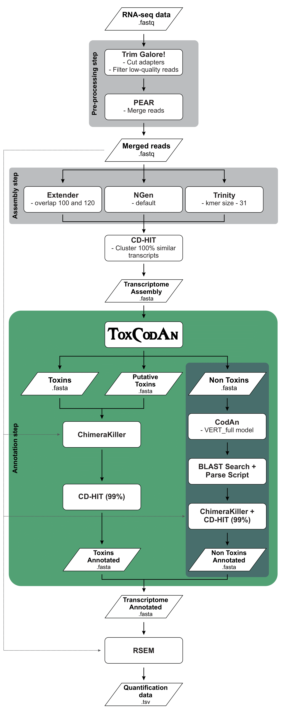
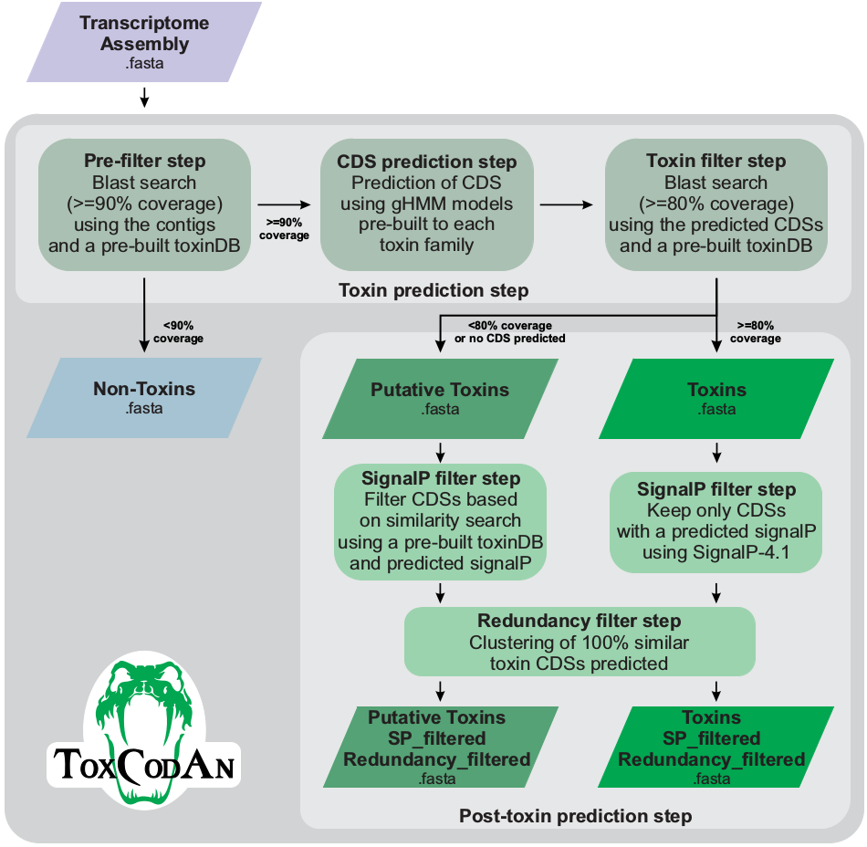
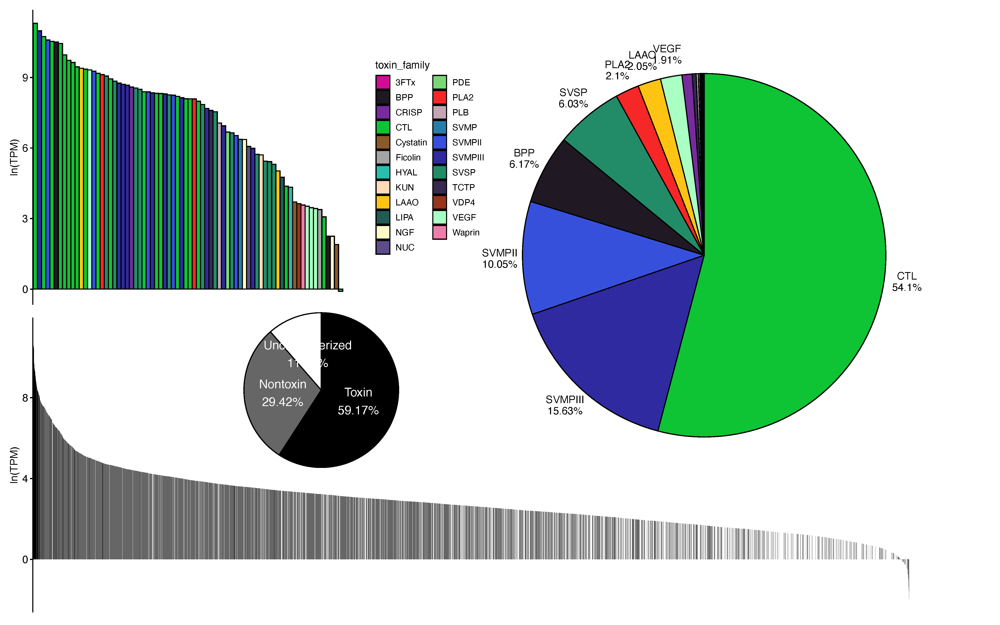
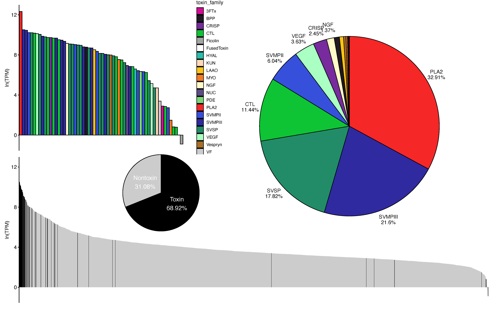
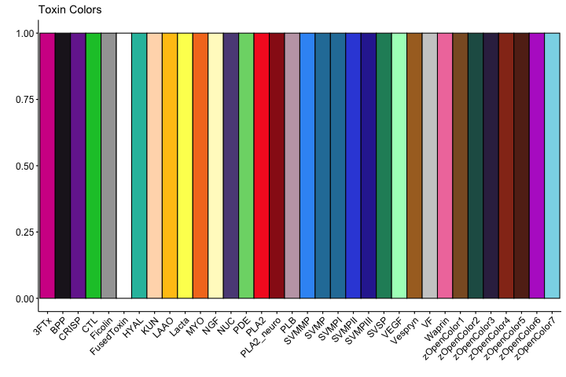
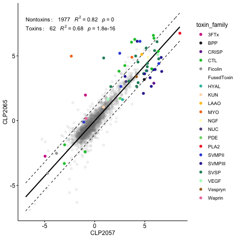
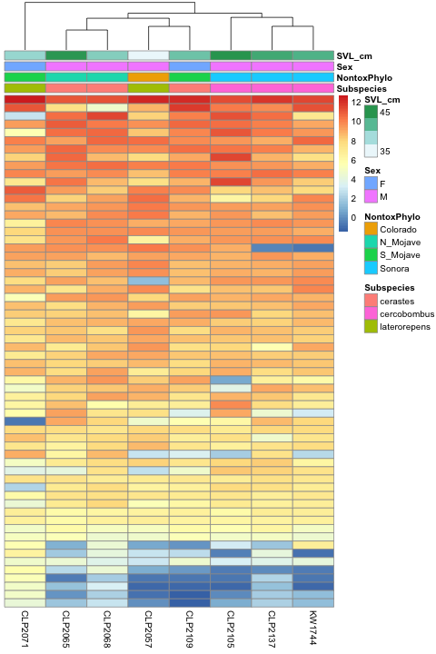
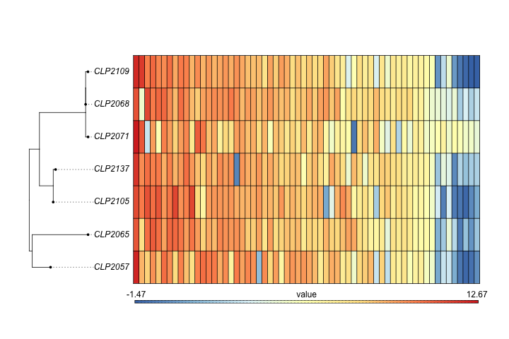
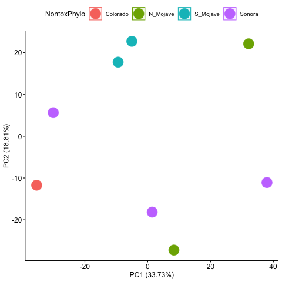
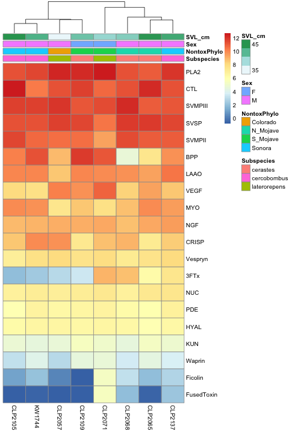

# The Guide to Venom Gland Transcriptomics
### Pedro G. Nachtigall, Rhett M. Rautsaw, Schyler Ellsworth, Andrew J. Mason, Darin R. Rokyta, Christopher L. Parkinson, Inácio L.M. Junqueira-de-Azevedo

# Introduction

The Guide to Venom Gland Transcriptomics is part of [**ToxCodAn**](https://github.com/pedronachtigall/ToxCodAn) and designed to walk you through our recommended bioinformatic pipeline. If you are new to bioinformatics, don’t worry! There are some resources and information provided at the beginning of the document to get you started. The topics covered in the Guide include:

- [Basic Bioinformatics](#basic-bioinformatics)
	- [Training Resources](#training-resources)
	- [Lists, Loops, and Parallelization](#lists-loops-and-parallelization)
	- [Piping & Regular Expressions](#piping-and-regular-expressions)
	- [Renaming Files](#renaming-files)
	- [UNIX Profiles](#unix-profiles)
	- [Software Management](#software-management)
- [The Guide](#the-guide)
	- [Downloading Data](#downloading-data)
	- [Pre-Processing](#pre-processing)
	- [Transcriptome Assembly](#transcriptome-assembly)
	- [Transcriptome Annotation](#transcriptome-annotation)
	- [Removing Chimeras](#removing-chimeras)
	- [Clustering](#clustering)
	- [Annotation Check (*Optional*)](#annotation-check-optional)
	- [Estimating Expression](#estimating-expression)
	- [Expression Visualization](#expression-visualization)
	- [Differential Expression](#differential-expression)

# Basic Bioinformatics

If you don't have much experience in **unix**, [**python**](https://www.python.org/), [**R**](https://www.r-project.org/) [**(Studio)**](https://rstudio.com/), or bioinformatics in general, then this section has some general resources and information that will help you get started and understand the rest of the Guide. The Guide is not designed to teach you *everything*, so we highly recommend working through the training resources first!

## Training Resources

[Software Carpentry](https://software-carpentry.org/lessons/) and [Data Carpentry](https://datacarpentry.org/lessons/) offer several freely-available lessons/workshops to get
you started learning **unix**, [**python**](https://www.python.org/), [**R**](https://www.r-project.org/), and much more:

- [Unix Lesson](http://swcarpentry.github.io/shell-novice/)
- [Python Lesson 1](https://swcarpentry.github.io/python-novice-inflammation/)
- [Python Lesson 2](http://swcarpentry.github.io/python-novice-gapminder/)
- [R Lesson 1](http://swcarpentry.github.io/r-novice-inflammation/)
- [R Lesson 2](http://swcarpentry.github.io/r-novice-gapminder/)

They even have workshops specific to genomics and ecology:

- [Genomic Workshops](https://datacarpentry.org/lessons/#genomics-workshop)
- [Ecology Workshops](https://datacarpentry.org/lessons/#ecology-workshop)

Some other useful resources might be:

- [SWIRL: Learn R in R](https://swirlstats.com/)
- [Learn-Bioinformatics Resources](https://github.com/czbiohub/learn-bioinformatics)
- [The macOS School of Terminal Witchcraft and Wizardry](https://scriptingosx.com/witchcraft/)

From here on, we assume that you have basic knowledge of **unix**. If you do not, please return to the lessons/workshops above.

## Lists, Loops, and Parallelization

**Lists** are your *best friend* in coding. A list – very simply – is a file containing all the names or identifiers that you will want to **loop** through or process in [**parallel**](https://www.gnu.org/software/parallel/) (*e.g.*, one line for each of your samples). You can create a simple text file in **unix** with the command `nano list.txt` and save the file using keyboard shortcut `ctrl+o` and exit with `ctrl+x`. A list will look something like this:

``` bash
sample_1
sample_2
...
sample_n
```

You can also create lists by simply saving the standard output (STDOUT) of a function to a file. For example:

``` bash
ls *.fastq > list.txt
```

Once you create a list, you can provide it to a `for loop` or to the [**`parallel`**](https://www.gnu.org/software/parallel/) command to process many samples the same way – and even simultaneously – without actually having to redo the same command over and over again. For example:

``` bash
# For Loops will "loop" through your list one-by-one 
# processing each the same way
for i in $(cat list.txt)
do echo ${i}
done

# GNU-Parallel or just parallel, will process items simultaneously.
# In this example, parallel will process 3 items at a time.
parallel -a list.txt -j 3 "echo {}"
```

We will be providing lists to the command [**`parallel`**](https://www.gnu.org/software/parallel/) in nearly every step of the Guide.

## Piping and Regular Expressions

**Piping** is the process of taking the STDOUT of one command and feeding it into the standard input (STDIN) of another. This is done with the vertical bar character `|` and can be useful for doing several commands in a row. Below, you will see that I use piping to create 3 different lists based on the fastq files I have in a directory.

The first list I create is a list of the unique individuals which we will use throughout the pipeline. In this list, each individual has it’s own line. The second two lists remove new line characters and replace them with spaces so that all individuals are on a single line.

``` bash
ls *.fastq.gz | cat | perl -pi -e 's/_.*.fastq.gz//g' | uniq > list.txt
sed "s/$/_R1.fastq/g" list.txt | tr '\n' ' ' | sed '/^\s*$/d' > list2.txt
sed "s/$/_R2.fastq/g" list.txt | tr '\n' ' ' | sed '/^\s*$/d' > list3.txt
```

Based on those lines of code, hopefully you understand that I am taking the output of the first command and feeding it into subsequent commands. However, you may be asking…what are `perl -pi -e`, `sed`, and `tr`?

Hopefully you have learned about `grep` and it’s ability to search for specific text in a document. What you may not know is that `grep` stands for Global Regular Expression Print. `grep`, `perl -pi -e`, `sed`, `tr`, and `awk` all use something called **Regular Expressions** or **regex** to find and/or replace text. I’ve used 3 different find/replace methods to generate my lists, but they are all essentially doing the same thing. regex takes a lot of practice, but they are incredibly useful in **unix** scripting. So take some time to learn them!

Useful regex resources:

- [RegexOne Training Lessons](https://regexone.com/)
- [Learn Regex](https://github.com/ziishaned/learn-regex)
- [Regex Cheatsheet](https://www.rexegg.com/regex-quickstart.html)
- [Regex Tester and Live Editor](https://regexr.com/)
- [Awk Tester and Live Editor](https://awk.js.org)
- [sed Tester and Live Editor](https://sed.js.org)

Each of the different regex methods (*i.e.*, `perl -pi -e`, `sed`, `awk`, etc.) have own features and unique formats; therefore, you may have to change between them. However, you will pick your favorite (whichever you learn first) and use it most frequently. My personal preference and the option I am most familiar with is `perl -pi -e`. [Here's an explanation of perl -pi -e.](https://stackoverflow.com/questions/6302025/perl-flags-pe-pi-p-w-d-i-t)

## Renaming Files

Sometimes files might have something appended to their name that you don’t want, so you need to rename them in specific way. If it is only one file, a simple `mv` command will do the trick. However, when there are a lot of files, renaming all of them can be a pain. Below, I provide three options for removing an unwanted underscore in all my file names.

**Option 1**: The `loop` and `mv` strategy

Here, we will loop through all files matching a pattern and `mv` them into a new file name. However, that new file name will be three arguments inside `${}` and separated by `/`. First the variable name again (`i`), then what you want to find (`sample_`), and finally what you want to replace that find with (`sample`).

``` bash
for i in sample_*.fastq.gz
	do mv $i ${i/sample_/sample}
	done
```

**Option 2**: The `find` and `rename` strategy

This option is very similar to the previous where we are finding all files with a certain pattern and then executing (`-exec`) the `rename` function on each. The rename function takes what we want to find (`sample_`), what we want to replace that find with (`sample`), and then the name of the file we want to perform this on. Since we are executing from `find`, the name of the file is represented by `{}`. This needs to be ended with `\;` to tell unix that your command is complete.

``` bash
find . -name "sample_*" -exec rename "sample_" "sample" {}\;
```

**Option 3**: The shell script strategy

This strategy takes a little more manual work, but is useful when you have less regular patterns to change, where each individual gets a slightly different name (*e.g.*, adding the species code which is found in a spreadsheet somewhere). In this situation, let Microsoft Excel help you.

To do this, create a list of all your individuals that need renamed. You can then copy-paste your list into Microsoft Excel to use things like find-replace and `VLOOKUP` to add a column including the species code.

You can also create a column to copy repeat elements like `mv` efficiently across all your individuals. Concatenate all your columns together and move it into a text document like the example below. Once you create your text bash script, you can just run `sh script.sh` to do all the work for you.

``` bash
#!/bin/bash

mv sample_001.fastq.gz sample-001.fastq.gz
mv sample-2.fastq.gz sample-002.fastq.gz
mv sample_3.fastq.gz sample-003.fastq.gz
#mv [MORE INDIVIDUALS]
```

## UNIX Profiles

Each step of the Guide assumes that you have already installed all the softwares that you need and it can be easily run by just typing in the appropriate command. Lets talk about how to make that assumption true.

First, it is important to know that unix has different **Shells**, also known as **command-line interpreters**. You've likely been using a Shell this whole time without knowing it because they are necessary to interpret every command you give. The standard for unix is the Bourne Shell (**sh**) or the Bourne-Again Shell (**bash**). However, if you are working on a Mac, your default might be the Z Shell (**zsh**). Any of these are are fine, but it is important to know which you are using for **unix profiles**.

If you want to know what Shell you're running you can just run `echo "$SHELL"`

Each time you start command-line or Terminal, your Shell will read specific files known as Shell initialization files to build your unix profile. The initialization files contain custom Shell configuration settings and can be found in your home directory (`cd ~`). The files are hidden (they begin with a period), but you can see hidden files with `ls -a`. 

If you are running **bash**, you will want to make your profile in **`.bash_profile`**. If you are running **zsh**, you will want to make your profile in **`.zshrc`**. If these files don't already exist, you may have to create them. You can use `nano` to both create and edit these files. 

``` bash
nano ~/.bash_profile
#OR
nano ~/.zshrc
```

There's lots of things you can put in your unix profile. For example, you can define shortcuts to do certain commands faster. Instead of typing `ls -lah`, why not just type `ll`. These are known as **aliases**. You can also define **functions** to do more complex things, like provide multiple arguments. An good explaination of alias and functions is given in the [Scripting OS X Blog](https://scriptingosx.com/2017/05/configuring-bash-with-aliases-and-functions/). 

Perhaps the most important thing in your unix profile is your **`$PATH`**, which is a variable containing a list of all possible directories where installed softwares may exist. Let's look at an example `.bash_profile` (this may be a good starting point for you):

``` bash
# Bash Profile

# User Profile
PS1="[Rhett@Macbook: \W] $ "

# SSH Profiles
alias remote="caffeinate ssh username@login.remote.server.edu"

# Alias Shortcuts
alias ll="ls -lah"
alias d="conda deactivate"
alias bio="conda activate bio"
alias envs="conda info --envs"

# Functions
mkcd ()
{
	mkdir -p -- "$1" && cd -P -- "$1"
}

# PATH
export PATH=/usr/local/bin:/usr/bin:/usr/sbin:/bin:/sbin
export PATH=$PATH:~/path/to/bin:~/path/to/bin/scripts
```

When I start a terminal/shell, **bash** will interpret my `.bash_profile`. It will tell it to print `[Rhett@Macbook: ~] $` at the beginning of each line. It will define each `alias` and `function` as a shortcut for specific commands. Finally, it will export my `$PATH` as: 
``` bash
/usr/local/bin:/usr/bin:/usr/sbin:/bin:/sbin:~/path/to/bin:~/path/to/bin/scripts
```
This string represents the location of several folders on my computer where scripts, commands, and softwares can be found. We haven't actually installed any softwares yet, but the next section will talk about a software management system that automatically adds softwares to your `$PATH`.

> **NOTE**
>
>`.zshrc` will look very similar - if not identical - to `.bash_profile`. If you are interested in moving from `bash` into the more feature-rich `zsh`, I recommend looking into:
>
>- [Scripting OS X: Moving to zsh](https://scriptingosx.com/2019/06/moving-to-zsh/)
>- [Oh My Zsh!](https://ohmyz.sh/)

## Software Management

[**Anaconda**](https://www.anaconda.com/distribution/#download-section) is a package/software management tool. I highly recommend you install Anaconda to make your life easier and avoid having to install many softwares by hand. 

When you install Anaconda, it will automatically add some script to your unix profile that will enable the Shell to find softwares installed by Anaconda. The reason Anaconda is so great is that software often do not play nicely with one another. For example, while one software may want to use `python v2.7`, another may want to use `python v3.6`. Anaconda allows you to create self-contained environments within which everything works nicely! If something needs a different version of a software…simply create a new environment! [Anaconda cheatsheet](https://docs.conda.io/projects/conda/en/4.6.0/_downloads/52a95608c49671267e40c689e0bc00ca/conda-cheatsheet.pdf)

After you install Anaconda, we can create some environments for later use. Here’s how you do that:

``` bash
# The first step you only need to do once after installation.
# These lines set up what "channels" anaconda should in for software
# Configure conda to look in certain channels for packages
conda config --add channels bioconda
conda config --add channels conda-forge
conda config --add channels defaults

# Install a couple very useful packages in your base conda environment
conda install wget
conda install parallel

# Create a bioinformatics environment
conda create -n bio # Create an environment named "bio"
conda activate bio # Activate your "bio" environment
conda install -y biopython bamtools bedtools blast bowtie2 bwa cd-hit emboss fastqc gatk4 jellyfish parallel pear picard pigz rsem samtools sra-tools trim-galore
conda deactivate # Deactivate your environment to exit

# Create a Trinity environment
conda create -n trinity_env trinity parallel

# Create a ToxCodAn environment
conda create -n toxcodan_env python=3.7 biopython perl perl-bioperl perl-mce blast hmmer parallel

# Create a ChimeraKiller environment
conda create -n chimerakiller_env python=3.6 biopython bwa samtools bedtools picard pandas matplotlib scipy pysam gatk4 pathos parallel
```

Notice that I created a `bio` environment as well as some separate environments. This is because softwares often have different dependencies. For example, [Trinity](https://github.com/trinityrnaseq/trinityrnaseq/wiki) requires a different version of [samtools](http://www.htslib.org/) than most other softwares installed in the `bio` environment. Putting softwares in their own environment ensures that they won’t interfere with each other. 

But how do you know when to create a new environment vs. just add to a pre-existing environment? Anaconda will generally warn you if it needs to change/upgrade/downgrade an existing software in that environment and will ask for confirmation to do this before continuing. When in doubt, create a new environment. You can create as many environments as you want and if something isn’t working properly, just create a new environment for it or remove the old environment and start over. All you have to do is remember to `conda activate` the correct environment before running an analysis.

I recommend to always try Googling "[`conda install {software}`](https://lmgtfy.app/?q=conda+install+trim+galore)" first; however, sometimes it is not possible to install things via Anaconda and you will have to manually download, install, and add the install location to your `$PATH`. I recommend creating a bin folder in an easily accessible location and installing all softwares in this folder. For example, I set up my bin folder in `~/Dropbox/bin` so that it can be accessed by any of my computers with Dropbox connected. You just need to make sure the `$PATH` is located in you unix profile on that computer.

Below, we download [ToxCodAn](https://github.com/pedronachtigall/ToxCodAn), [CodAn](https://github.com/pedronachtigall/CodAn.git), and [signalp](https://services.healthtech.dtu.dk/software.php) and add them to our `$PATH`. I also recommend running the tutorial for each software to ensure it is installed properly.

``` bash
# Git clone the ToxCodAn repository and add to your PATH:
git clone https://github.com/pedronachtigall/ToxCodAn.git
echo "export PATH=\$PATH:$PWD/ToxCodAn/bin" >> ~/.bash_profile

# Git clone the CodAn repository and add to your PATH:
git clone https://github.com/pedronachtigall/CodAn.git
echo "export PATH=\$PATH:$PWD/CodAn/bin" >> ~/.bash_profile

# Download the SignalP-4.1, decompress and add it to your PATH:
tar -xvzf signalp-4.1g.Linux.tar.gz
echo "export PATH=\$PATH:$PWD/signalp-4.1/" >> ~/.bash_profile

# Source your .bash_profile to activate changes
source ~/.bash_profile
```

<br>

# The Guide

<p align="center">

</p>

## Downloading Data

We will use a *Crotalus cerastes* sample from [Hofmann & Rautsaw et al. 2018](https://www.nature.com/articles/s41598-018-33943-5?proof=true) as an example for the Guide. You can download these data with `wget` or use [**`fastq-dump`**](https://ncbi.github.io/sra-tools/fastq-dump.html) from [**`sra-tools`**](https://github.com/ncbi/sra-tools).

``` bash
conda activate bio
fastq-dump --gzip --skip-technical --read-filter pass --dumpbase --split-3 --clip SRR6768682
echo SRR6768682 >> list.txt
```

**NOTE**: There are many flags or arguments given to the `fastq-dump` function above. Flags or arguments are denoted with dashes such as `-a` or `--argument`. In the Guide, we will NOT explain every argument for every command, but an explanation can usually be found using `{software} -h` or `man {software}`.

## Pre-Processing

With the data downloaded, let’s get organized by creating a folder for each sample and a folder for the raw data.

Generally our file structure will look like this:

	.
	|-- sample_001
	|	|-- 01_raw
	|	|	|-- sample_001_R1.fastq.gz
	|	|	|-- sample_001_R2.fastq.gz
	|	|-- 02_trim
	|	|	|-- sample_001_trimmed_R1.fastq.gz
	|	|	|-- sample_001_trimmed_R2.fastq.gz
	|	...
	|	|-- 12_transcriptome
	|		|-- sample_001_transcriptome_v1.fasta
	|-- sample_002
		|-- 01_raw
		|	|-- sample_002_R1.fastq.gz
		|	|-- sample_002_R2.fastq.gz
		|-- 02_trim
		|	|-- sample_002_trimmed_R1.fastq.gz
		|	|-- sample_002_trimmed_R2.fastq.gz
		...
		|-- 12_transcriptome
			|-- sample_002_transcriptome_v1.fasta

Here, I am using the [**`parallel`**](https://www.gnu.org/software/parallel/) command to with the `-a` flag to provide it a list of our samples and the `-j` flag to tell it how many jobs to do at a single time. This may need to be modified based on your computer.

``` bash
parallel -a list.txt -j 2 --verbose "echo {}
	mkdir -p {}/01_raw
	mv {}_pass_1.fastq.gz {}/01_raw/{}_R1.fastq.gz
	mv {}_pass_2.fastq.gz {}/01_raw/{}_R2.fastq.gz"
```

### Quality Check

[**fastqc**](http://www.bioinformatics.babraham.ac.uk/projects/fastqc/) is used to check the quality of your sequencing reads. You may want to do this several times throughout the process. Primarily before and after trimming low-quality bases and reads.

``` bash
parallel -a list.txt -j 2 --verbose "echo {}
	cd {}/01_raw
	fastqc {}*.fastq.gz -t 4
	open *.html"
```

### Trimming

The sequencer provides quality scores (also known as [phred scores](https://drive5.com/usearch/manual/quality_score.html)) that indicate how good a given base call was. We obviously want to trim off reads that have poor quality. We generally use [**Trim Galore**](https://github.com/FelixKrueger/TrimGalore) to do this, but [**TRIMMOMATIC**](http://www.usadellab.org/cms/index.php?page=trimmomatic) is another option. We can run fastqc right after to see the difference trimming makes in our data.

``` bash
parallel -a list.txt -j 2 --verbose "echo {}
	cd {}
	mkdir 02_trim
	trim_galore --paired --phred33 --length 75 -q 5 --stringency 1 -e 0.1 -o 02_trim 01_raw/{}_R1.fastq.gz 01_raw/{}_R2.fastq.gz &> 02_trim/{}_tg.log
	cd 02_trim
	mv {}_R1_val_1.fq.gz {}_R1_trim.fastq.gz
	mv {}_R2_val_2.fq.gz {}_R2_trim.fastq.gz
	fastqc *.fastq.gz
	open *.html"
```

### Merging Reads

With our reads trimmed, we can merge our forward and reverse reads to create slightly longer “super reads” which will be better for assembly and easier to manage. To do this, we use the [**Paired-End reAd mergeR (PEAR)**](https://cme.h-its.org/exelixis/web/software/pear/).

``` bash
parallel -a list.txt -j 2 --verbose "echo {}
	cd {}
	mkdir 03_merge
	pear -j 4 -f 02_trim/{}_R1_trim.fastq.gz -r 02_trim/{}_R2_trim.fastq.gz -o 03_merge/{}_pear > 03_merge/{}_pear.log
	cd 03_merge
	pigz -9 -p 4 *unassembled*.fastq
	pigz -9 -p 4 *discarded.fastq"
```

## Transcriptome Assembly

The next step is to assemble our reads into contigs. Although the process is a little more complex than this, you can think of it as taking our short 150-250 bp fragments and lining them up end-to-end to determine what goes together. This isn’t necessary if you have a reference genome as you can simply take your reads and map them back to your reference with something like [HiSat2](http://daehwankimlab.github.io/hisat2/). However, if we don’t have a reference genome, the process of assembly and annotation can be extremely challenging.

For *de novo* transcriptome assembly, we use a combination of three different assemblers to produce our transcriptomes, these include [**Extender**](https://bmcgenomics.biomedcentral.com/articles/10.1186/1471-2164-13-312), [**SeqMan NGen**](https://www.dnastar.com/manuals/seqman-ngen/17.0/en/topic/welcome-to-seqman-ngen), and [**Trinity**](https://github.com/trinityrnaseq/trinityrnaseq/wiki). You are welcome to use even more assemblers or different assemblers; however, we chose these assemblers because they use three different ways to assemble the transcriptome. This pipeline and how these assemblers were chosen can be read about in [Holding et al. 2018](https://www.mdpi.com/2072-6651/10/6/249). Briefly, typical transcriptome assemblers (*e.g.*, Trinity) use a method known as **de Bruijn graphs**, while Extender and NGen use much simpler methods. However, these simpler methods are better at catching longer transcripts – such as Snake Venom Metalloproteases (SVMP) – that are frequently missed by Trinity.

### Extender

[**Extender**](https://bmcgenomics.biomedcentral.com/articles/10.1186/1471-2164-13-312) is a straightforward assembler which does not use de Bruijn graphs. Developed by [Rokyta et al. 2012](https://bmcgenomics.biomedcentral.com/articles/10.1186/1471-2164-13-312), Extender essentially grabs ‘seed’ reads from the reads pile and then uses a sliding window approach to see if it can extend these seeds on either end. While we don’t want to get into the mechanisms of Extender too much, we do want you to know a couple of things about the outcome of using it. The first is that Extender is really good at assembling large transcripts like metalloproteases. In fact, it is probably the best assembler we have for assembling metalloproteases right now, which is part of why it is so important. Another thing to know about Extender is that it primarily assembles really abundant transcripts, which means that it misses a lot. So Extender will give us much lower numbers of transcripts than the other assemblers, but in many cases more of what we really want: Toxins.

To run Extender we just need the merged reads from the previous step. Please contact D. Rokyta for access to Extender.

``` bash
parallel -a list.txt -j 2 --verbose "echo {}
	cd {}
	mkdir 04_extender
	cd 04_extender
	Extender3.py -r ../03_merge/{}_pear.assembled.fastq -s 1000 -o 120 -msq 30 -mrq 20 -reps 20 -p 0.20 -e 2 -np 20 > {}_extender.log"
```

### NGen

[**SeqMan NGen**](https://www.dnastar.com/manuals/seqman-ngen/17.0/en/topic/welcome-to-seqman-ngen) (DNAStar, Inc., Madison, WI, USA) is proprietary assembler which does not use de Bruijn graphs. Because it is proprietary, you may opt to use several other assemblers instead. However, if you do choose to purchase or gain access to use SeqMan, we use default settings for transcriptome assembly.

### Trinity

[**Trinity**](https://github.com/trinityrnaseq/trinityrnaseq/wiki) is the typical de Bruijn graph transcriptome assembler. There is plenty of information online regarding Trinity including [videos](https://www.broadinstitute.org/broade/trinity-screencast) that explain Trinity in detail.

**NOTE:** Remember that we created a separate environment for Trinity, so you will need to activate this environment

``` bash
conda activate trinity_env
parallel -a list.txt -j 2 --verbose "cd {}
	  mkdir 06_trinity
	  cd 06_trinity
	  Trinity --seqType fq --CPU 4 --min_contig_length 200 --max_memory 20G --full_cleanup –output {} --single ../03_merge/{}_pear.assembled.fastq"
conda deactivate
```

### Combining Assemblies

Now that we have our three assemblies complete, we can combine them into one before annotation. Each of the assemblers produces a fasta file of assembled contigs with complex names. We can just go ahead and rename each of those as contig1, contig2, …, contigX. There are many ways to do this and we provide an example of how to do this with `awk`, but we recommend using [**`Fasta_Renamer.py`**](https://github.com/reptilerhett/Bioinformatics), which is a script to rename fasta headers sequentially.

Here, I’m copying the final assemblies from each assembler, renaming them, and concatenating them together into a combined assembly. After this, we run [**cd-hit**](http://weizhongli-lab.org/cd-hit/) to remove transcripts with 100% identity to reduce redundancy and computational load for annotation.

**Option 1:** `awk`

``` bash
for i in `cat list.txt`
	do echo $i
	cd $i
	mkdir 07_assembly
	awk '/^>/{print ">extenderContig" ++i; next}{print}' < 04_extender/Final_Extender_contigs.fasta >  07_assembly/${i}_extender.fasta
	awk '/^>/{print ">ngenContig" ++i; next}{print}' < 05_ngen/${i}_NGen14_NovelTranscripts.fas >  07_assembly/${i}_ngen.fasta
	awk '/^>/{print ">trinityContig" ++i; next}{print}' < 06_trinity/${i}.Trinity.fasta >  07_assembly/${i}_trinity.fasta
	cd 07_assembly
	cat ${i}_extender.fasta ${i}_ngen.fasta ${i}_trinity.fasta > ${i}_assembly.fasta
	cd-hit-est -i ${i}_assembly.fasta -o ${i}_assembly_reduced.fasta -d 0 -c 1.00
	cd ../..
	done
```

OR

**Option 2:** [**`Fasta_Renamer.py`**](https://github.com/reptilerhett/Bioinformatics)

``` bash
parallel -a list.txt -j 2 --verbose "echo {}
	cd {}
	mkdir 07_assembly 
	cp 04_extender/Final_Extender_contigs.fasta 07_assembly/{}_extender.fasta
	cp 05_ngen/{}_NGen14_NovelTranscripts.fas 07_assembly/{}_ngen.fasta
	cp 06_trinity/{}.Trinity.fasta 07_assembly/{}_trinity.fasta
	cd 07_assembly
	Fasta_Renamer.py -f {}_extender.fasta -n extenderContig
	Fasta_Renamer.py -f {}_ngen.fasta -n ngenContig
	Fasta_Renamer.py -f {}_trinity.fasta -n trinityContig
	cat {}_extender.fasta {}_ngen.fasta {}_trinity.fasta > {}_assembly.fasta
	cd-hit-est -i {}_assembly.fasta -o {}_assembly_reduced.fasta -d 0 -c 1.00"
```

## Transcriptome Annotation

### ToxCodAn
<p align="center">

</p>

[**ToxCodAn**](https://github.com/pedronachtigall/ToxCodAn) was designed to identify and annotate toxins from a *de novo* venom gland transcriptome assembly. This software uses [**BLAST**](https://blast.ncbi.nlm.nih.gov/Blast.cgi) and trained generalized Hidden Markov Models (gHMM) to identify toxins in our assembly and annotated them. We will then use the resulting files `{}_Toxins_cds_Redundancyfiltered.fasta` and `{}_PutativeToxins_cds_SPfiltered.fasta`, combining them together and appending “TOXIN” to the beginning of the fasta names.

``` bash
conda activate toxcodan_env
parallel -a list.txt -j 2 --verbose "echo {}
	cd {}
	mkdir 08_toxcodan 
	toxcodan.py -s {} -t 07_assembly/{}_assembly_reduced.fasta -o 08_toxcodan -m /path/to/models -c 4
	cd 08_toxcodan
	cat {}_Toxins_cds_Redundancyfiltered.fasta {}_PutativeToxins_cds_SPfiltered.fasta > {}_Toxins.fasta
	perl -pi -e 's/>/>TOXIN_/g' {}_Toxins.fasta"
```

> **The last line of this code is adding "TOXIN" to the beginning of each fasta sequence. We highly recommend that you do this because we will be combining these sequences with nontoxin annotations. Adding "toxin" to the beginning of the fasta sequences will make downstream formatting of dataframes much easier.**

### Nontoxin Annotation

For nontoxin annotation, we will take the Nontoxin output from [ToxCodAn](https://github.com/pedronachtigall/ToxCodAn) (`{}_NonToxins_contigs.fasta`) and use [CodAn](https://github.com/pedronachtigall/CodAn) to predict to predict the coding sequence (CDS) regions, using the [VERTEBRATE model (VERT_full)](https://github.com/pedronachtigall/CodAn/blob/master/models). The CodAn-predicted CDS regions will be used as input for ToxCodAn’s `NonToxinAnnotation.py` which uses [**BLAST**](https://blast.ncbi.nlm.nih.gov/Blast.cgi), [**BUSCO**](https://busco.ezlab.org/) (optional), and [**Pfam**](http://pfam.xfam.org/) (optional) to annotate the predicted CDSs. 

**NOTE:** This step keeps the uncharacterized proteins for potential novel toxin discovery.

- Download the SwissprotDB from the NCBI ftp site (<a href="ftp://ftp.ncbi.nlm.nih.gov/blast/db/swissprot.tar.gz" class="uri">ftp://ftp.ncbi.nlm.nih.gov/blast/db/swissprot.tar.gz</a>). Decompress it `tar -xvzf swissprot.tar.gz`.
	- If this isn't working you can download the fasta file here (<a href="ftp://ftp.uniprot.org/pub/databases/uniprot/current_release/knowledgebase/complete/uniprot_sprot.fasta.gz" class="uri">ftp://ftp.uniprot.org/pub/databases/uniprot/current_release/knowledgebase/complete/uniprot_sprot.fasta.gz</a>) and run `makeblastdb` to turn into a BLASTDB.
	- `makeblastdb -in uniprot_sprot.fasta -dbtype prot`
- If the user wants, more than one proteinDB can be set in the `-d` option by using a comma “,” separating the DBs (*e.g.*, `path/to/db1,path/to/db2,…,path/to/dbN`).
- (Optional) Download the desired BUSCO models [here](https://busco-data.ezlab.org/v4/data/lineages/) and decompress the odb with `tar -xvzf busco_odb.tar.gz`
	- Recommend the tetrapod or aves odb for snakes.
- (Optional) Download the Pfam models (<a href="ftp://ftp.ebi.ac.uk/pub/databases/Pfam/current_release/Pfam-A.hmm.gz" class="uri">ftp://ftp.ebi.ac.uk/pub/databases/Pfam/current_release/Pfam-A.hmm.gz</a>) and decompress with `gunzip Pfam-A.hmm.gz`

``` bash
parallel -a list.txt -j 2 --verbose "echo {}
	cd {}
	mkdir 09_nontoxins
	mv 08_toxcodan/{}.toxcodan_NonToxins_contigs.fasta 09_nontoxins/
	cd 09_nontoxins
	unzip path/to/CodAn/models/VERT_full.zip
	codan.py -t {}.toxcodan_NonToxins_contigs.fasta -m VERT_full/ -o {}_NonToxins_codan -c 4
	mv {}_NonToxins_codan/ORF_sequences.fasta {}_NonToxins_CDS.fasta
	NonToxinsAnnotation.py -t {}_NonToxins_CDS.fasta -d path/to/swissprot -b path/to/BUSCO/odb -p path/to/Pfam-A.hmm -c 4
	mv Annotation_output/annotated.fa {}_NonToxins_annotated.fasta"
conda deactivate
```

With both toxins and nontoxins annotated, we can combine them back together.

``` bash
parallel -a list.txt -j 2 --verbose "echo {}
	cd {}
	mkdir 10_CompleteAnnotation
	cat 08_toxcodan/{}_Toxins.fasta 09_nontoxins/{}_NonToxins_annotated.fasta > 10_CompleteAnnotation/{}_annotated.fasta"
```

>### ToxCodAn-Nontoxin Annotation Integration
>
>Nontoxin annotation has been integrated directly into ToxCodAn. You do not need to do this step if you've already completed Nontoxin annotation, but if the user wants to directly perform the nontoxin annotation within ToxCodAn just follow the steps below:
>```
>cd path/to/ToxCodAn/non_toxin_models/
>tar -xjf pepDB.tar.bz2 
>gunzip VERT_full.zip
>toxcodan.py -s sampleID -t assembly.fasta -o out_toxcodan -m /path/to/models -c 4 -n path/to/non_toxin_models/
>```


### Manual Annotation

If you don’t think ToxCodAn is doing the trick or you want to be incredibly thorough and make sure you got everything, feel free to expand this section to learn how we manually annotate venom gland transcriptomes. If you are comfortable with ToxCodAn performance, you can skip down to the section on [Removing Chimeras](#removing-chimeras).

<details>
<summary>Expand Manual Annotation Section</summary>

#### **BLAST**

First, we need to identify (to the best of our ability) each of the contigs in our assembly. One of the easiest ways to do this is with a [**BLAST**](https://blast.ncbi.nlm.nih.gov/Blast.cgi) search against a database of known things (*e.g.* GenBank, SwissProt). We could take each of our contigs one-by-one and use the BLAST web interface, but that would be really slow. Therefore, we will download a database onto our local computer and then use command line BLAST. Depending on the size of the assembled contigs file, this may run for a few minutes or for a few hours. Afterwards though, you will have an xml file that contains the BLAST results of your search.

If you have not downloaded the [SwissProt database](https://www.uniprot.org/downloads) yet, go ahead and download this into a folder in your bin. It’s a good idea to date this folder so you know when you downloaded it. You can then turn the fasta into a BLAST database with the following code.

``` bash
gunzip uniprot_sprot.fasta.gz
mv uniprot_sprot.fasta 2020-12-13_SwissProt.fasta
makeblastdb -in 2020-12-13_SwissProt.fasta -dbtype prot
```

Below, I’ve done a `blastx` search against the full `SwissProt` database. The output (`-outfmt 5`) is xml format.

``` bash
parallel -a list.txt --verbose -j 2 "echo {}
	cd {}
	mkdir 08_blast
	cd 08_blast
	blastx -query ../07_assembly/{}_assembly_reduced.fasta -db /path/to/2020-12-13_SwissProt.fasta -outfmt 5 -num_threads 4 -max_target_seqs 10 -evalue 0.0001 -out {}_blastUPT.xml"
```

>**WARNING**:
>
>- BLAST is often the best option we have, but it is only as good as the database you provide. If your database is incomplete (*as all databases are*), you may miss true toxins.
>- For example, if you use the [`UniProt Toxins database`](https://www.uniprot.org/program/Toxins), this means that only well-annotated toxins are going to receive matches and nontoxins will remain unidentified.

#### **Geneious**

[**Geneious**](https://www.geneious.com/) is a graphical user interface (GUI) to visualize DNA/RNA sequence data. Unfortunately Geneious requires a subscription, so you may want to look into alternatives to Geneious. However, being able to visualize sequences and open reading frames is critical to perform manual annotation. We will proceed here describing the general process in Geneious. 

We first generate a file/folder structure in Geneious for each sample that resembles the following First, open Geneious and create the following file structure for each of your individuals.

	Geneious
	|-- sample_001
		|-- Unannotated
		|-- Annotated
		|	|-- Toxin
		|	|-- Nontoxin
		|	|-- Bad
		|	|-- Uncharacterized
		|--  CDS

Then, drag your unannotated assembly contigs `07_assembly/{}_assembly_reduced.fasta` into `Geneious/Unannotated`.

#### **Find Open Reading Frames (ORFs)**

If assembly was perfect, then each contig would represent a complete transcript with a start and stop codon. Unfortunately, this is not the case. The transcripts are actually “hidden” within the contigs. Therefore, we need to identify the correct start/stop codons inside our contigs. 

There can be multiple start/stops in each contig and these are known as the “Open Reading Frames” or ORFs. [ToxCodAn](#ToxCodAn) attempts to automate the identification of the correct ORF or coding sequence (CDS), but now you get to experience it for yourself and gain an understanding for why automating CDS identification is so challenging.

Select all your contigs and go to the `Annotate & Predict` menu and and choose `Find ORFs`. Choose the following options:

- Minimum ORF Size: 90 bp
- Assume Start/Stop outside of Sequence

Each contig should now have multiple ORFs annotated onto them. Which one is correct?! You are now ready to begin manual annotation.

#### **Annotate**

To annotate and choose the correct ORF, we compare the available ORFs to the BLAST results using something similar to [**blastxmlparser**](https://github.com/pjotrp/blastxmlparser). However, it may be easier to consider [alternate BLAST output formats](https://www.ncbi.nlm.nih.gov/books/NBK279684/). Additionally, Geneious has the option to annotate from a database. Therefore, if you have a folder of previously annotated toxins, toxin domains, or transcripts in general, this may also be useful to help you choose the correct ORF.

When annotating, pay particular attention to the size of the ORF. We have a spreadsheet of expected approximate sizes compiled from decades of research that you can see [here](https://docs.google.com/document/d/1nUsX4HFKeHoa6Io93bz6wpebrUtInzq1yg6O0LMIr-I/edit?usp=sharing). After identifying which ORF (if any) is the most appropriate, you will then annotate it. If you’re unsure if a transcript is good, I suggest leaning on the side of keeping it since later steps (*e.g.*, Removing Chimeras) will help eliminate bad transcripts.

If there is no match, then just throw the contig into the `Bad` folder you created and move onto the next contig. When you find a match:

- Double click ORF:
	- Name: CDS
	- Type: CDS
- Save
- Rename contig to {SampleName}\_{Toxin}\_extender1

#### **Export**

Once you get through all the contigs, I suggest you add “TOXIN” to the name of all your toxins for easy sorting later. This can be done with the `batch rename` function in Geneious.

After you do this, select all of your annotated `Toxins`, `Nontoxins`, and `Uncharacterized` transcripts and extract the annotated regions of each contig. To do this, go to the `Tools` menu and select `Extract Annotations`. Move the extracted CDS into the `CDS` folder.

Now we just need to export all those sequences into a single fasta named `{}_CDS.fasta` and we will put them in a new folder.

``` bash
parallel -a list.txt -j 2 --verbose "echo {}
	cd {}
	mkdir 10_CompleteAnnotation"
```

#### **Remove Duplicates and Ambiguities**

Our fasta of annotated transcripts likely has a lot of duplicate sequences and sequences with ambiguities. We want to get rid of these. To do that we can use [`RemAmbRemDup.py`](https://github.com/reptilerhett/Bioinformatics).

``` bash
parallel -a list.txt -j 2 --verbose "echo {}
	cd {}/10_CompleteAnnotation
	RemDupRemAmb.py -f {}_CDS.fasta -o {}_annotated"
```

Pat yourself on the back for getting through annotation!

</details>
<br>

## Removing Chimeras

Unfortunately, not everything we annotate with ToxCodAn or manually is real. Some of the transcripts represent artifacts of *de novo* transcriptome assembly where two or more transcripts are accidentally merged into one creating **chimeras**. We need to filter out **chimeras** to produce the *true* transcriptome.

[**ChimeraKiller**](https://github.com/masonaj157/ChimeraKiller) is designed to identify chimeric sequences. It starts by mapping the reads to your annotated transcripts. ChimeraKiller then looks at each site along a transcript and determines the average coverage to the left and right of that position. At chimeric sites, the reads from the two transcripts will butt up against one another. Therefore, as you near chimeric sites the discrepency in the number of bases to the left and right will increase. For example, if the average number of bases per read to the left is 10 and the average number of bases per read to the right is 200, the difference between them is 190. Using a percent difference threshold, the transcript will be removed.

``` bash
conda activate chimerakiller_env
parallel -a list.txt -j 2 --verbose "echo {}
	cd {}
	mkdir 11_chimerakiller
	cd 11_chimerakiller
	ChimeraKiller_v0.7.3.py -i ../10_CompleteAnnotation/{}_annotated.fasta  -r ../03_merged/{}_pear.assembled.fastq -d 0.75 -p 4"
conda deactivate
```

It is now a good idea to manually check the decisions made by ChimeraKiller. After we check the calls by ChimeraKiller we can concatenate the good fastas together. We will do this in the next section…

## Clustering

Congrats!! At this point you’ve basically created a transcriptome. We aren’t quite done, but the last few steps are just further reducing redundancy and double-checking that we’ve got everything annotated.

First, lets reduce more redundancy. Right now, our transcriptome contain heterozygous alleles of the same transcript. We don’t need to have both alleles represented in our transcriptome. We can try to reduce this using [**cd-hit**](http://weizhongli-lab.org/cd-hit/) to cluster sequences at 99% identity.

``` bash
parallel -a list.txt -j 2 --verbose "echo {}
	cd {}
	mkdir 12_transcriptome
	cat 11_chimerakiller/fastas/good/*.fasta > 12_transcriptome/{}_transcriptome_v0.fasta
	cd 12_transcriptome
	cd-hit-est -i {}_transcriptome_v0.fasta -o {}_transcriptome_v1.fasta -d 0 -c 0.99"
```

>**Species Consensus Transcriptomes**
>
>If you are creating a species consensus transcriptome, you probably want to do another round of clustering. Specifically, you will concatenate all the transcriptomes for a species together and use [**cd-hit**](http://weizhongli-lab.org/cd-hit/) to reduce redundancy that has resulted from general sequence variation among individuals. In this case, you may want to cluster at 98% (*i.e.* -c 0.98) or lower.
>
>Here is an example, clustering together our two *B. alternatus* samples.
>
>``` bash
>cat */12_transcriptome/*_transcriptome_v1.fasta > Balternatus_concat_transcriptome_v1.fasta
>cd-hit-est -i Balternatus_concat_transcriptome_v1.fasta -o Balternatus_concensus_transcriptome_v1.fasta -c 0.98
>```

## Annotation Check (*Optional*)

[ToxCodAn](https://github.com/pedronachtigall/ToxCodAn) and `NonToxinAnnotation.py` are designed to predict CDS and annotate things potentially missed by ToxCodAn and even keep uncharacterized transcripts. This not only provides confidence in your transcriptome, but facilitates novel toxin discovery. Specifically, by estimating expression of all transcripts including those that remain uncharacterized, you might discover a new toxin given it's high expression level. 

However, there are a couple other optional steps you might be able to take to make sure you don’t miss anything. Primarily,

- Proteomics (quantitative mass spectrometry) and
- Estimating expression of all ORFs in the transcriptome assembly.

If you want to see more, then expand this section below!

<details>
<summary>Expand Annotation Check Section</summary>

Both proteomics and ORF checks start by requiring a fasta of all ORFs in the transcriptome assembly. We can use [**EMBOSS**](https://www.bioinformatics.nl/emboss-explorer/) to do this, generating both the nucleotide and protein ORFs. We will also run [**cd-hit**](http://weizhongli-lab.org/cd-hit/) to reduce redundancy and make different parts of the downstream analyses a little easier.

``` bash
parallel -a list.txt -j 2 --verbose "echo {}
	cd {}/07_assembly
	getorf -find 1 -minsize 90 -sequence {}_assembly.fasta -outseq {}_ORFs.pro
	getorf -find 3 -minsize 90 -sequence {}_assembly.fasta -outseq {}_ORFs.fasta
	# Proteins use cd-hit
	cd-hit -i {}_ORFs.pro -o {}_clusteredORFs.pro -d 0 -c 1.0
	# Nucleotides use cd-hit-est
	cd-hit-est -i {}_ORFs.fasta -o {}_clusteredORFs.fasta -d 0 -c 1.0"
```

### Proteomics

You can use quantitative mass spectrometry (qMS) to help identify important proteins in the venom. Specfically, providing the protein ORFs during qMS can help identify which ORFs are abundant in the proteome and may represent important or novel toxins. We will not talk about the generation of qMS data from the venom, but we use [**Scaffold**](http://www.proteomesoftware.com/products/scaffold/) to generate and export the ORFs of importance.

Scaffold will show you which ORFs had proteomic matches which you can then export (`{}_Scaffold.pro`), cluster to your annotated transcriptome, and annotate what remains with BLAST.

The script [**QTIBAC**](https://github.com/reptilerhett/QTIBAC) can help do this automatically. QTIBAC is a wrapper script which uses [**BLAST**](https://blast.ncbi.nlm.nih.gov/Blast.cgi), [**cd-hit**](http://weizhongli-lab.org/cd-hit/), and [**ChimeraKiller**](https://github.com/masonaj157/ChimeraKiller) to cluster proteomically (quantitative mass spectrometry/qMS) identified ORFs to your transcriptome, blast them to a provided database (or to the NR database on Genbank), and remove chimeric ORFs.

``` bash
parallel -a list.txt -j 2 --verbose "echo {}
	cd {}/13_qms
	QTIBAC.py -f ../07_assembly/{}_ORFs.fasta -q {}_Scaffold.pro -a ../12_transcriptome/{}_transcriptome_v1.fasta -r ../03_merged/{}_pear.assembled.fastq -o {} -db /path/to/2020-12-13_SwissProt.fasta -b blastx -c -p 99 -t 8"
```

### ORF Expression Check

If you do not have a proteome, you can still check the expression of the ORFs to determine if you might have missed something important in your transcriptome. To do this, estimate expression of all ORFs using [**RSEM**](https://github.com/deweylab/RSEM) and use the results to make a list of the top X most highly expressed ORFs. Using grep, you can then extract those ORFs and use our proteomic friend [**QTIBAC**](https://github.com/reptilerhett/QTIBAC) in the same manner.

``` bash
parallel -a list.txt -j 2 --verbose "echo {}
	cd {}
	mkdir 13_orf_check
	cd 13_orf_check
	rsem-prepare-reference --bowtie2 ../07_assembly/{}_clusteredORFs.fasta {}_ORF_Reference
	rsem-calculate-expression --bowtie2 ../03_merged/{}_pear.assembled.fastq {}_ORF_Reference {}
	rsem-plot-model {} {}_diagnostic.pdf
	sort -k5nr {}.genes.results | head -50 | cut -f1 > high_expression_orfs.list
	grep -w -f hiexp_orfs.list -A1 ../07_assembly/{}_clusteredORFs.fasta > {}_hiexp_orfs.fasta
	grep -w -f hiexp_orfs.list -A1 ../07_assembly/{}_clusteredORFs.pro > {}_hiexp_orfs.pro
	QTIBAC.py -f {}_hiexp_orfs.fasta -q {}_hiexp_orfs.pro -a ../12_transcriptome/{}_transcriptome_v1.fasta -r ../03_merged/{}_pear.assembled.fastq -o {} -db /path/to/2020-12-13_SwissProt.fasta -b blastx -c -p 99 -t 8"
```

> By performing BLAST searches on the most highly expressed ORFs, you are able to determine if there are toxin families or toxins that you might have missed. This is actually how we identified Snake Venom Matrix Metalloproteases (svMMPs) in *Conophis lineatus* [(Bayona-Serrano et al. 2020)](https://academic.oup.com/mbe/advance-article-abstract/doi/10.1093/molbev/msaa192/5877437)

</details>
<br>

## Estimating Expression

With our *final* transcriptome generated, we can now estimate expression of each transcript with [**RSEM**](https://github.com/deweylab/RSEM) or [**kallisto**](https://pachterlab.github.io/kallisto/.)

``` bash
parallel -a list.txt -j 2 --verbose "echo {}
	cd {}
	mkdir 13_RSEM
	cd 13_RSEM
	rsem-prepare-reference --bowtie2 ../12_transcriptome/{}_transcriptome_v1.fasta {}_Reference
	rsem-calculate-expression --bowtie2 ../03_merged/{}_pear.assembled.fastq {}_Reference {}
	rsem-plot-model {} {}_diagnostic.pdf"
```

## Expression Visualization

For visualization of transcript expression, we will move into [**R**](https://www.r-project.org/). 
We have included two exemplary datasets in this repository (`example_data`). 
1. RSEM results for a *Bothrops alternatus* generated in this study. 
	- `Balte-SB0022CVR.genes.results`: Raw RSEM output (tab-delimited file)
2. RSEM results for eight *Crotalus cerastes* generated by [Hofmann and Rautsaw et al. (2018)](https://www.nature.com/articles/s41598-018-33943-5?proof=true).
	- `Ccera-CLP2057.genes.results`: Raw RSEM output for CLP2057 only (tab-delimited file)
	- `Ccera_rsem_counts.csv`: RSEM read counts for all 8 individuals
	- `Ccera_rsem_tpm.csv`: RSEM transcripts per million (TPM) for all 8 individuals
	- `Ccera_samples.csv`: Sample metadata

We have also included two **R Scripts** to facilitate **formatting** RSEM/kallisto output and **plotting** results. 
1. **`autoplot.R`**: An executable script that will read RSEM/kallisto output and attempt to classify transcripts into their appropriate categories. The formatted dataframe is exported as a `csv` and a plot of the expression data is exported in pdf and svg formats. You can skip formatting (on pre-formatted dataframes) or plotting with the `--noformat` and `--noplot` flags, respectively.
2. **`PlottingFunctions.R`**: R code containing the underlying functions used to plot the data and assign colors to specific toxins.

### autoplot.R
```{bash}
cd /path/to/ToxCodAn/Guide

# Bothrops alternatus raw RSEM output
# These data followed ToxCodAn Guide and had "TOXIN" appended to each sequence
./autoplot.R -i example_data/Balte-SB0022CVR.genes.results -s Balte-SB0022CVR

# Crotalus cerastes raw RSEM output
# These data did NOT follow ToxCodAn Guide or have "TOXIN" appended to sequences.
# Here, we add the --iforgot flag to change the internal grep search. 
./autoplot.R -i example_data/Ccera-CLP2057.genes.results -s Ccera-CLP2057 --iforgot

# Run autoplot.R in parallel for all your samples.
#parallel -a list.txt -j 2 --verbose "echo {}
#	cd {}/13_RSEM
#	/path/to/autoplot.R -i {}.genes.results -s {}"
```

<p align="center">

</p>

In addition to the raw RSEM outputs, we've included a spreadsheet with formatted RSEM results for all eight *Crotalus cerastes* generated by [Hofmann and Rautsaw et al. (2018)](https://www.nature.com/articles/s41598-018-33943-5?proof=true). These spreadsheets already contain  "class" and "toxin_family" columns. We can still use `autoplot.R` with `--noformat` to skip formatting and go straight to plotting. 

`autoplot.R` will still try to clean up the dataframe to ensure proper plotting (see **df_clean**) function below.

```{bash}
./autoplot.R -i example_data/Ccera_rsem_tpm.csv -s CLP2057 --noformat
```

<p align="center">

</p>

### Individual Functions
We do not have to use `autoplot.R`, but instead can make each of the subplots independently in R using the functions provided in `PlottingFunctions.R`. 

First we need to `source` the R script. This script will also attempt to install many of the required packages. 

```{r}
#setwd("path/to/ToxCodAn/Guide")
source("./PlottingFunctions.R")
```

<p align="center">

</p>

Now we can load our data into R. 

```{r}
TPM_df <- read_csv("./example_data/Ccera_rsem_tpm.csv")
TPM_df <- TPM_df %>% mutate_if(is.character,as.factor)
```

#### Data Cleaning/Formatting
To ensure that the "class" and "toxin_family" columns are formatted properly for the functions inside `PlottingFunctions.R`, we can run **df_clean**.

```{r}
TPM_df <- df_clean(TPM_df, class="class", toxin_family="toxin_family", colors=toxin_colors)
```

| class	| toxin_family	| --> | class	| toxin_family |
|-------|---------------|-----|---------|--------------|
| toxin	| pla2		 	| --> | Toxin	| PLA2 |
| t		| BPP			| --> | Toxin	| BPP |
| T		| svMPIII		| --> | Toxin	| SVMPIII |
| Tox	| ctl			| --> | Toxin	| CTL |
| tox	| SVMPII		| --> | Toxin	| SVMPII |
| Toxin	| SVMPIII		| --> | Toxin	| SVMPIII |

<br>

Visualizing/plotting expression data is generally better on a transformed scale; however, you cannot log-transform zeros. You could add a constant (TPM +1) to all transcripts, but when you have multiple individuals, you can impute zeros using Bayesian-Multiplicative replacement in the [**zCompositions**](https://github.com/Japal/zCompositions) package shown here.  
```{r}
# Impute 0 values
# Take numeric values (columns 4-12), transpose them, impute zeros, and re-transpose
TPM_df2 <- t(cmultRepl(t(TPM_df[,4:12]),output = "p-counts"))

# Bind back to original dataframe
TPM_df2 <- cbind(TPM_df[,1:3], TPM_df2)
rownames(TPM_df2) <- TPM_df2$gene_id
```

#### Plots
Now we are ready to make our plots. There are four functions to visualize expression in a single individual. Then `FancyFigure` uses all of these functions to make one plot (this is what `autoplot.R` uses).
```{r}
FullBarplot(TPM_df2,"CLP2057",class="class")

FullPie(TPM_df2,"CLP2057",class="class")

ToxinBarplot(TPM_df2,"CLP2057",class="class",toxin_family="toxin_family", colors=toxin_colors)

ToxinPie(TPM_df2,"CLP2057",class="class",toxin_family="toxin_family", colors=toxin_colors)

# WRAPPER FOR ALL FOUR PLOTS IN ONE
FancyFigure(TPM_df2,"CLP2057",class="class",toxin_family="toxin_family", colors=toxin_colors)
```

I recommend exporting as `svg` or `pdf` so you can easily manipulate any part of this figure using something like [`Inkscape`](https://inkscape.org/)

### Other Types of Plots
#### Transcriptome Comparison Plots
To compare the expression of any two individuals, you can use the `TransCompPlot` function provided in `PlottingFunctions.R`.

```{r}
TransCompPlot(TPM_df2, "CLP2057", "CLP2065")
```
<p align="center">

</p>

#### Heatmaps
The package [**pheatmap**](https://github.com/raivokolde/pheatmap) is useful for making Heatmaps of expression across many individuals. To annotate the heatmaps, we need to load in the metadata (`Ccera_samples.csv`).

```{r}
samples <- read_csv("./example_data/Ccera_samples.csv")
samples <- as.data.frame(samples) %>% mutate_if(is.character,as.factor)
rownames(samples) <- samples$ID

# Log-transforming data
lnToxins <- TPM_df2 %>% filter(class == "Toxin") %>% 
	mutate_if(is.numeric,log) %>% 
	arrange(desc(Average))
rownames(lnToxins) <- lnToxins$gene_id

pheatmap(lnToxins[,4:11], cluster_rows=F, show_rownames=F,cluster_cols=T, 
	annotation_col=samples[,2:5], annotation_legend=T)
```

<p align="center">

</p>

> **For CLR transformation use package [compositions](http://www.stat.boogaart.de/compositions/)**
> ```
> library(compositions)
> clrToxins <- TPM_df2 %>% filter(class == "Toxin") %>% 
> 	mutate_if(is.numeric,clr) %>% 
> 	arrange(desc(Average))
> rownames(clrToxins) <- lnToxins$gene_id
> ```

#### Phylogeny Heatmap

You could also use a phylogeny as the tree for the heatmap using [**ape**](http://ape-package.ird.fr/) and [**phytools**](https://github.com/liamrevell/phytools).

```{r}
library(ape)
Tree<-read.tree(file="./example_data/Ccera-Phylogeny.nwk")

library(phytools)
phylo.heatmap(Tree, t(lnToxins[,4:11]), fsize=c(1,0.8,1), standardize=F, labels=F,
	split=c(0.3,0.7), ylim=c(-0.25,1.25), grid=T,
	colors=colorRampPalette(rev(brewer.pal(n = 7,name="RdYlBu")))(100))
```

<p align="center">

</p>

#### PCA
Finally, you can visualize expression variation with Principal Components Analysis (PCA).

```{r}
PCA <- prcomp(as.data.frame(t(TPM_df2[,4:11])), center=TRUE, scale=TRUE)
PCA_df<-data.frame(samples,PCA$x)

contribs<-round((PCA$sdev^2/sum(PCA$sdev^2))*100,2)

ggscatter(PCA_df,"PC1","PC2",color="NontoxPhylo",fill="NontoxPhylo",size=8,
	ellipse = T, ellipse.level = 0.95, ellipse.type = "norm",
	xlab = paste0("PC1 (",contribs[1],"%)"), ylab=paste0("PC2 (",contribs[2],"%)"))
```

<p align="center">

</p>

#### Toxin Family Expression
We can also do each of these things for each toxin family instead of individual toxins. For example, here's a heatmap of toxin family expression.

```{r}
# Summing data by toxin family
TPM_family_df <- TPM_df2 %>% 
	filter(class=="Toxin") %>%
	group_by(toxin_family,class) %>% 
	summarize_if(is.numeric,sum) %>%
	arrange(desc(Average)) %>% ungroup()
TPM_family_df <- as.data.frame(TPM_family_df)
rownames(TPM_family_df) <- TPM_family_df$toxin_family

# Log transform
lnClasses <- as.data.frame(TPM_family_df) %>%
	mutate_if(is.numeric,log) %>%
	arrange(desc(Average))
rownames(lnClasses) <- lnClasses$toxin_family

pheatmap(lnClasses[,3:10], cluster_rows=F, show_rownames=T,cluster_cols=T, 
	annotation_col=samples[,2:5], annotation_legend=T)
```

<p align="center">

</p>

## Differential Expression

To perform differential expression (DE) analysis we need to use the expected counts instead of the TPM normalized data because DE analysis packages have their own normalization processes. 

We also need to install the necessary packages from [**Bioconductor**](https://www.bioconductor.org/).

```
# Load Counts
Counts_df <- read_csv("./example_data/Ccera_rsem_counts.csv")
Counts_df <- Counts_df %>% mutate_if(is.character,as.factor)

Counts_class_df<-as.data.frame(Counts_df %>% group_by(toxin_class,class) %>% 
	summarize_if(is_numeric,sum))
rownames(Counts_class_df)<-Counts_class_df$toxin_class


# Install Bioconductor Packages
install.packages("BiocManager")
library(BiocManager)

# Check if DESeq2 and edgeR are already installed.
# If not, install them.
packages<-c("DESeq2","edgeR")
installed_packages <- packages %in% rownames(installed.packages())
if (any(installed_packages == FALSE)) {
	BiocManager::install(packages[!installed_packages])
}
lapply(packages, library, character.only = TRUE)
```

### DESeq2

```{r}
DESeq_df<-as.data.frame(Counts_df[,4:11])
rownames(DESeq_df)<-Counts_df$gene_id
DESeq_df<-as.matrix(DESeq_df)
for (i in 1:ncol(DESeq_df)){
	DESeq_df[,i]<-as.integer(DESeq_df[,i])
}

## SVL Comparison
DESeq2<-DESeqDataSetFromMatrix(DESeq_df,metadata, design = ~SVL_cm)
DESeq2<-DESeq(DESeq2,fitType = "local")
DESeq2_res <- as.data.frame(results(DESeq2,alpha=0.05))
table<-DESeq2_res[DESeq2_res$padj<0.05,]
table<-head(table[complete.cases(table),c(2,6)])
```
| gene_id													| log2FC		| padj		 |
|-----------------------------------------------------------|--------------:|-----------:|
| Ccera-CLP2057ext_CTL-9_ngenContig2269_-_CDS				|  0.29425216	| 0.02338078 |
| Ccera-CLP2105ext_MYO-2_extContig94_-_CDS					|  0.39747275	| 0.02338078 |
| Ccera-CLP2057_SVMPIII_extContig339_-_CDS					| -0.28421367	| 0.02338078 |
| Ccera-CLP2057ext_SVMPIII-2_extContig390_-_CDS				| -0.17398424	| 0.02338078 |
| Ccera-CLP2057ext_ADH_ngenContig195_-_CDS					| -0.06053533	| 0.03895370 |
| Ccera-CLP2065ngen_AminoAcidTrans1_ngenContig5623_-_CDS	| 	 0.12298525	| 0.04642247 |

```
## Phylogenetic Comparison
DESeq2<-DESeqDataSetFromMatrix(DESeq_df,metadata, design = ~NontoxPhylo)
DESeq2<-DESeq(DESeq2)
DESeq2_res <- as.data.frame(results(DESeq2, 
	contrast=c("NontoxPhylo","S_Mojave","N_Mojave"),
	alpha=0.05))
table<-DESeq2_res[DESeq2_res$padj<0.05,]
table<-head(table[complete.cases(table),c(2,6)])
```

| gene_id											| log2FC	| padj		   |
|---------------------------------------------------|----------:|-------------:|
| Ccera-KW1744ext_BPP-1a_extContig132_-_CDS			|  7.075668	| 5.189999e-08 |
| Ccera-CLP2057ext_PLA2-1a_extContig89_-_CDS		|  2.148142	| 4.467611e-02 |
| Ccera-CLP2105ext_SVMPII-4_extContig172_-_CDS		| -3.352636	| 3.900254e-02 |
| Ccera-CLP2105ngen_SVSP-10_ngenContig295_-_CDS		| -2.698754	| 1.105192e-02 |
| Ccera-CLP2057ext_VEGF-1_extContig1_-_CDS			|  2.441901	| 4.789369e-02 |
| Ccera-CLP2071ngen_39SrpL24_ngenContig6518_-_CDS	|  2.442785	| 2.608682e-07 |


### edgeR

```{r}
edgeR_df <- DGEList(counts=DESeq_df,samples=metadata)
keep <- rowSums(cpm(edgeR_df)>1) >= 2
edgeR_df <- edgeR_df[keep, , keep.lib.sizes=FALSE]
rm(keep)
edgeR_df <- calcNormFactors(edgeR_df)

# SVL Comparison
design <- model.matrix(~SVL_cm, data=edgeR_df$samples)
dispersion <- estimateDisp(edgeR_df,design)
fit <- glmFit(dispersion,design)
edgeR_res<-as.data.frame(topTags(glmLRT(fit,coef="SVL_cm"),n=Inf,sort.by="none"))
table<-edgeR_res[edgeR_res$FDR<0.05,]
table<-head(table[complete.cases(table),c(1,5)])
```

| gene_id											| logFC			| FDR		 |
|---------------------------------------------------|--------------:|-----------:|
| Ccera-CLP2057ext_CTL-9_ngenContig2269_-_CDS		|  0.2943580	| 0.02230040 |
| Ccera-CLP2057ext_SVMPIII-2_extContig390_-_CDS		| -0.1744778	| 0.03014379 |
| Ccera-CLP2057ext_NucRec4A1_ngenContig2966_-_CDS	| -0.1933113	| 0.02230040 |

```
# Phylogenetic Comparison
design <- model.matrix(~NontoxPhylo, data=edgeR_df$samples)
dispersion <- estimateDisp(edgeR_df,design)
fit <- glmFit(dispersion,design)
edgeR_res<-as.data.frame(topTags(glmLRT(fit,
	coef=c("NontoxPhyloN_Mojave","NontoxPhyloS_Mojave")),
	n=Inf,sort.by="none"))
table<-edgeR_res[edgeR_res$FDR<0.05,]
table<-head(table[complete.cases(table),c(1,5)])
```
| gene_id												| logFC		| FDR		   |
|-------------------------------------------------------|----------:|-------------:|
| Ccera-KW1744ext_BPP-1a_extContig132_-_CDS				| -3.483285	| 3.416361e-06 |
| Ccera-CLP2057ext_CTL-5_extContig12_-_CDS				| -2.873082	| 5.439565e-04 |
| Ccera-CLP2105ext_MYO-2_extContig94_-_CDS				|  9.956143	| 4.379644e-12 |
| Ccera-CLP2071ngen_39SrpL24_ngenContig6518_-_CDS		| -2.073622	| 1.091375e-06 |
| Ccera-CLP2057ext_3bHDDIsom_ngenContig4815_-_CDS		| -2.327748	| 8.408196e-04 |
| Ccera-CLP2071ngen_ADPRibosyl1-2_ngenContig5670_-_CDS	|  0.000000	| 6.485014e-34 |
